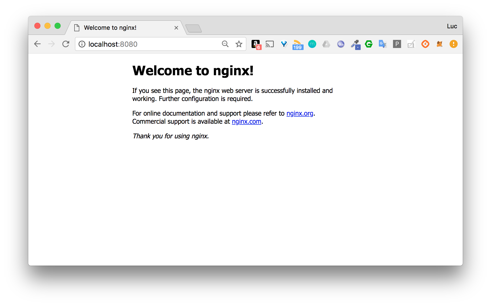

## Enoncé

Le but de cet xercice est de créer un container en exposant un port sur la machine hôte

1. Lancez un container basé sur nginx et publiez le port 80 du container sur le port 8080 de l’hôte

2. Vérifiez depuis votre navigateur que la page par défaut de nginx est servie sur http://localhost:8080

3. Lancez un second container en publiant le même port

Qu’observez-vous ?

---

## Correction

1. La commande suivante permet de lancer le container basé sur nginx et d'exposer le port 80 de ce container sur le port 8080 de la machine hôte

```
docker container run -d -p 8080:80 nginx 
```

2. La page index.html servie par défaut par nginx est accessible sur le port 8080



3. Si nous lançons un autre container en utilisant le même port de la machine hôte, nous obtenons une erreur car ce port ne peut pas être utilisé pour les 2 containers.

```
$ docker container run -d -p 8080:80 nginx
c9dc92128bd8871d1c75678fd41dc09c5afcf02857c7c64bd89f560cb2b6aec7
docker: Error response from daemon: driver failed programming external connectivity on endpoint objective_leakey (25ea6fe30398e51b5ad3dbd55a56cded518370c81a41d4013d58ca399647718a): Bind for 0.0.0.0:8080 failed: port is already allocated.
```
