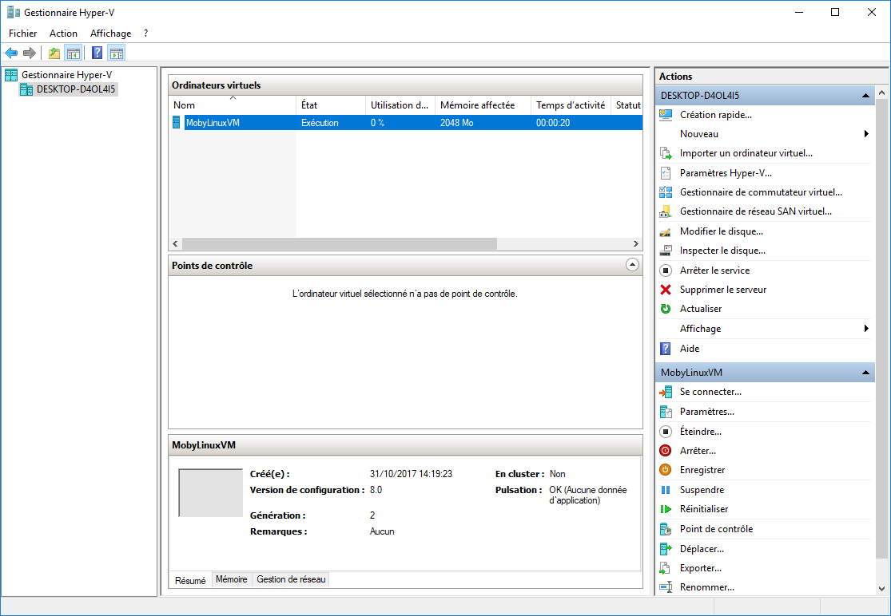
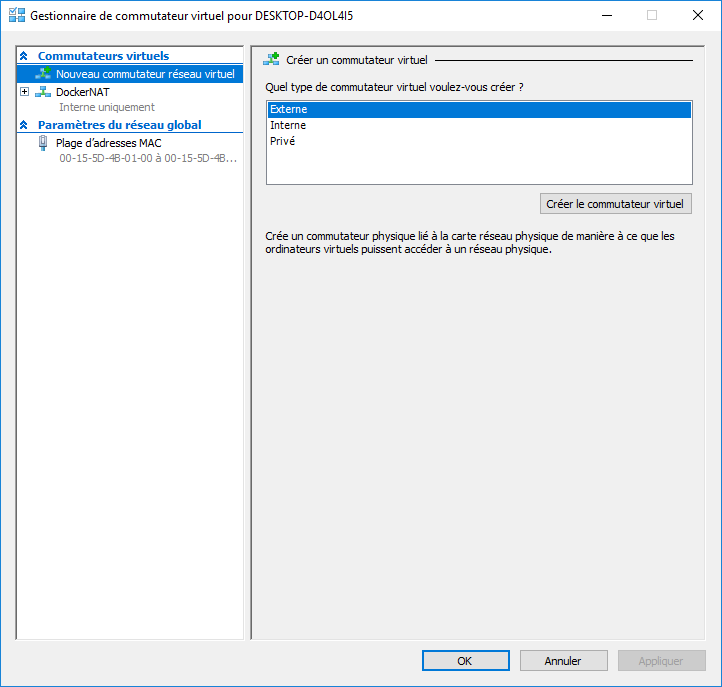
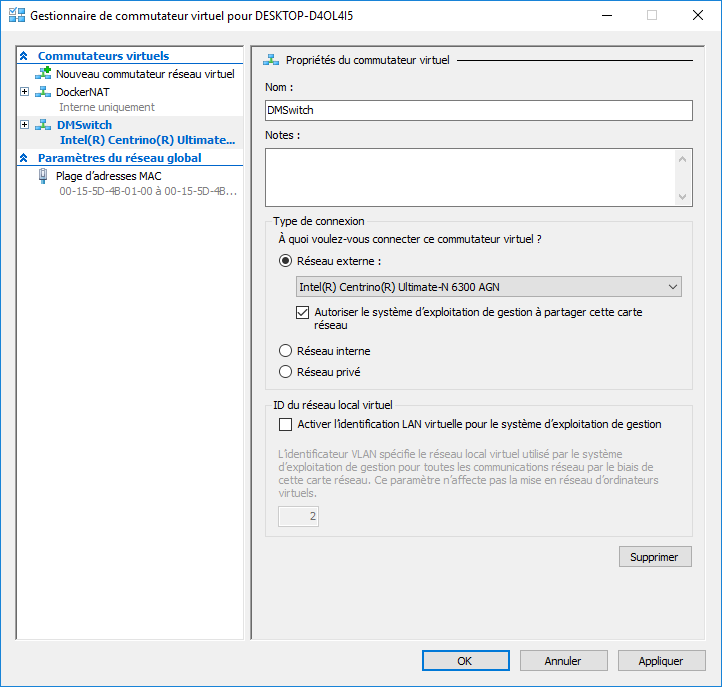
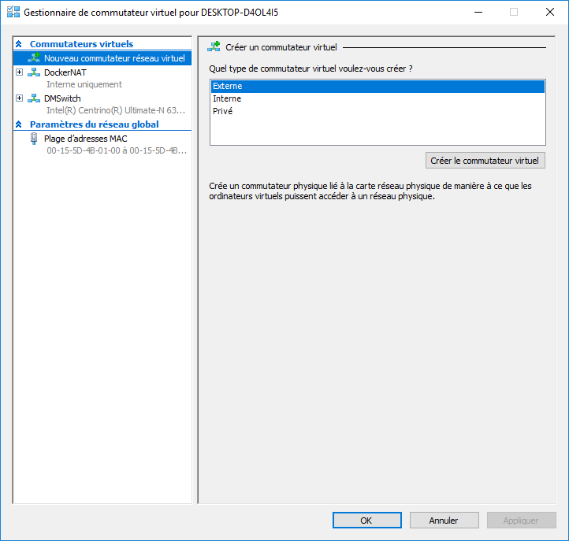

Docker Machine est un utilitaire permettant d'instancier des hôtes Docker.

Il s'interface avec des hyperviseur locaux (Virtualbox, Hyper-V) et également avec de nombreux cloud providers (DigitalOcean, Amazon EC2, Google Compute Engine, Microsoft Azure, ...)

Dans cette mise en pratique, nous allons illustrer la création d'un hôte en fonction de l'environnement utilisé:
* Docker for Windows
* Docker for Mac
* Docker for Ubuntu (et autre version de la plateforme sur Linux)

### Docker for Windows / Hyper-V

Afin de pouvoir utiliser Docker Machine dans un environnement Docker for Windows, il nous faut au préalable créer un virtual switch (commutateur virtuel) depuis l'interface d'administration de Hyper-V.



Dans cette exemple, nous créeons un switch nommé **DMSwitch** comme illustré dans les copies d'écran suivantes. Nous précisons un réseau externe et selectionnons le réseau de la machine hôte.







Nous pouvons alors utiliser Docker Machine en précisant le driver **hyperv** ainsi que le nom de notre switch virtuel avec l'option **--hyperv-virtual-switch**

```
PS C:\WINDOWS\system32> docker-machine create --driver hyperv --hyperv-virtual-switch "DMSwitch" node1
Running pre-create checks...
Creating machine...
(node1) Copying C:\Users\luc\.docker\machine\cache\boot2docker.iso to C:\Users\luc\.docker\machine\machines\node1\boot2docker.iso...
(node1) Creating SSH key...
(node1) Creating VM...
(node1) Using switch "DMSwitch"
(node1) Creating VHD
(node1) Starting VM...
(node1) Waiting for host to start...
Waiting for machine to be running, this may take a few minutes...
Detecting operating system of created instance...
Waiting for SSH to be available...
Detecting the provisioner...
Provisioning with boot2docker...
Copying certs to the local machine directory...
Copying certs to the remote machine...
Setting Docker configuration on the remote daemon...
Checking connection to Docker...
Docker is up and running!
To see how to connect your Docker Client to the Docker Engine running on this virtual machine, run: C:\Program Files\Docker\Docker\Resources\bin\docker-machine.exe env node1
```

La commande suivante permet de lister les hôtes que nous venons de créer

```
PS C:\WINDOWS\system32> docker-machine ls
NAME    ACTIVE   DRIVER   STATE     URL                       SWARM   DOCKER        ERRORS
node1   -        hyperv   Running   tcp://192.168.1.25:2376           v17.10.0-ce
```

### Docker for Mac

Pour Docker for Mac nous utilisons [Virtualbox](https://www.virtualbox.org/) afin de créer un hôte Docker en local.

La commande suivante permet de créer un hôte nommé **node1**

```
$ docker-machine create --driver virtualbox node1
Running pre-create checks...
Creating machine...
(node1) Copying /Users/luc/.docker/machine/cache/boot2docker.iso to /Users/luc/.docker/machine/machines/node1/boot2docker.iso...
(node1) Creating VirtualBox VM...
(node1) Creating SSH key...
(node1) Starting the VM...
(node1) Check network to re-create if needed...
(node1) Waiting for an IP...
Waiting for machine to be running, this may take a few minutes...
Detecting operating system of created instance...
Waiting for SSH to be available...
Detecting the provisioner...
Provisioning with boot2docker...
Copying certs to the local machine directory...
Copying certs to the remote machine...
Setting Docker configuration on the remote daemon...
Checking connection to Docker...
Docker is up and running!
To see how to connect your Docker Client to the Docker Engine running on this virtual machine, run: docker-machine env node1
```

### Docker for Linux (Ubuntu, ...)

De la même façon que pour Docker for Mac, dans un environnement Linux nous utiliserons [Virtualbox](https://www.virtualbox.org/) afin de créer un nouvel hôte Docker local.

```
$ docker-machine create --driver virtualbox node1
Running pre-create checks...
(node1) Default Boot2Docker ISO is out-of-date, downloading the latest release...
(node1) Latest release for github.com/boot2docker/boot2docker is v17.10.0-ce
(node1) Downloading /home/luc/.docker/machine/cache/boot2docker.iso from https://github.com/boot2docker/boot2docker/releases/download/v17.10.0-ce/boot2docker.iso...
(node1) 0%....10%....20%....30%....40%....50%....60%....70%....80%....90%....100%
Creating machine...
(node1) Copying /home/luc/.docker/machine/cache/boot2docker.iso to /home/luc/.docker/machine/machines/node1/boot2docker.iso...
(node1) Creating VirtualBox VM...
(node1) Creating SSH key...
(node1) Starting the VM...
(node1) Check network to re-create if needed...
(node1) Waiting for an IP...
Waiting for machine to be running, this may take a few minutes...
Detecting operating system of created instance...
Waiting for SSH to be available...
Detecting the provisioner...
Provisioning with boot2docker...
Copying certs to the local machine directory...
Copying certs to the remote machine...
Setting Docker configuration on the remote daemon...
Checking connection to Docker...
Docker is up and running!
To see how to connect your Docker Client to the Docker Engine running on this virtual machine, run: docker-machine env node1
```

De la même façon que précédemment, la commande suivante permet de s'assurer que notre hôte fonctionne correctement.

```
$ docker-machine ls
NAME    ACTIVE   DRIVER       STATE     URL                         SWARM   DOCKER        ERRORS
node1   -        virtualbox   Running   tcp://192.168.99.100:2376           v17.10.0-ce
```

## SSH dans node1

Quelque soit la version de la plateforme (Docker for Mac, Docker for Windows, ...) nous pouvons utiliser Docker Machine pour se connecter en SSH sur la machine que nous venons de créer.

```
$ docker-machine ssh node1
```
