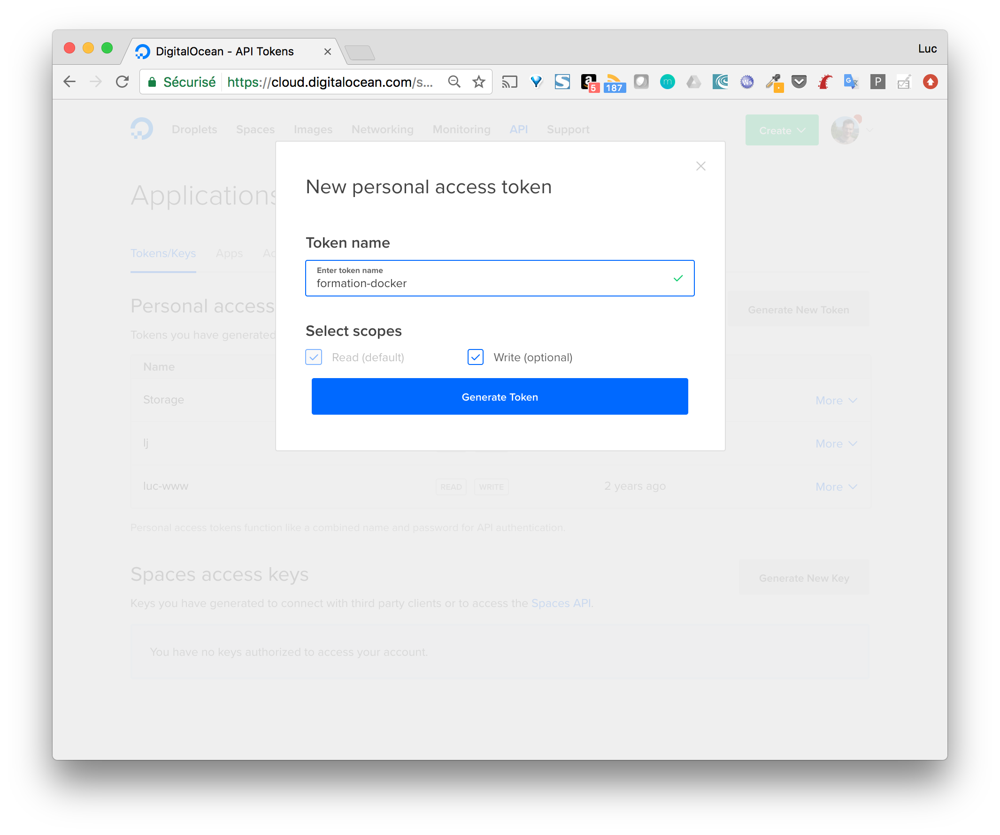
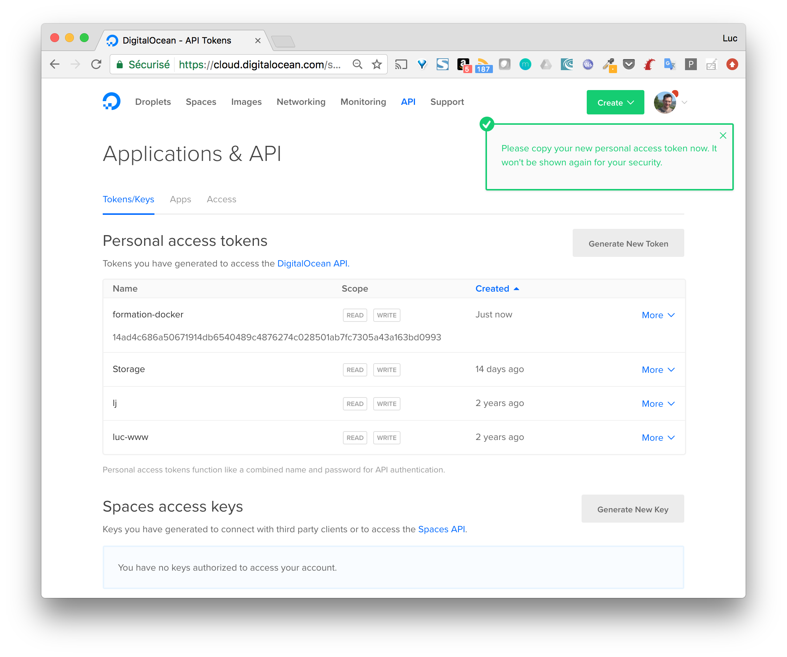

Dans cette mise en pratique, nous allons créer un hôte Docker sur le cloud provider [DigitalOcean](https://digitalocean.com).

> Attention, cet exercice est optinel car l'utilisation de DigitalOcean (comme de l'ensemble des cloud providers) est payante. Vous pouvez suivre cet exercice pour comprendre comment l'on utilise DigitalOcean avec Docker Machine mais vous n'êtes pas obligé de créer un compte si vous ne le souhaitez pas.

Si vous souhaitez aller plus loin, vous pouvez créer un compte sur DigitalOcean ou utiliser le votre. Il faudra cependant le provisionner avec quelques $ (5$ sera suffisant pour commencer à jouer et découvrir l'environnement). Ensuite, depuis le menu API de l'interface, générez un nouveau token comme illustré sur les copies d'écran suivantes.





> Dès que le token est créé, copiez le et conservez le à un endroit sûr car il ne sera plus possible de le récupérer depuis l'interface par la suite. 

Avec ce token, vous pouvez à présent créer un hôte Docker avec Docker Machine. Il suffira de préciser les paramètres suivants:
* le driver à utiliser: **--driver digitalocean**
* le token d'authentification: **--digitalocean-access-token $TOKEN** (en supposant que celui-ci est dans la variable d'environnement TOKEN)

La commande à lancer est donc la suivante:

```
$ docker-machine create --driver digitalocean --digitalocean-access-token $TOKEN node1
Running pre-create checks...
Creating machine...
(node1) Creating SSH key...
(node1) Creating Digital Ocean droplet...
(node1) Waiting for IP address to be assigned to the Droplet...
Waiting for machine to be running, this may take a few minutes...
Detecting operating system of created instance...
Waiting for SSH to be available...
Detecting the provisioner...
Provisioning with ubuntu(systemd)...
Installing Docker...
Copying certs to the local machine directory...
Copying certs to the remote machine...
Setting Docker configuration on the remote daemon...
Checking connection to Docker...
Docker is up and running!
To see how to connect your Docker Client to the Docker Engine running on this virtual machine, run: docker-machine env node1
```
 

> Par défaut, la machine virtuelle créée est basée sur Ubuntu 16.04. Vous pouvez cependant utiliser des options supplémentaires afin de modifier le comportement par défaut. La liste des options est disponible à l'adresse suivante: [Options du driver DigitalOcean](https://docs.docker.com/machine/drivers/digital-ocean/#options). Attention néanmoins de ne pas utiliser de machines surdimensionnées afin de ne pas épuiser votre crédit trop rapidement.

La commande suivante permet de lister les différentes machines créées à partir du binaire Docker Machine. Dans le cas présent, nous obtenons seulement la machine créée sur DigitalOcean. Quelques informations sont disponibles, comme son adresse IP, la version de Docker installée, ...

```
$ docker-machine ls
NAME    ACTIVE   DRIVER         STATE     URL                         SWARM   DOCKER        ERRORS
node1   -        digitalocean   Running   tcp://165.227.125.33:2376           v17.10.0-ce
```

Il est alors possible de se connecter en ssh sur ce nouvel hôte et de lancer les commandes Docker que nous avons vu jusque la.

```
$ docker-machine ssh node1
...
```
