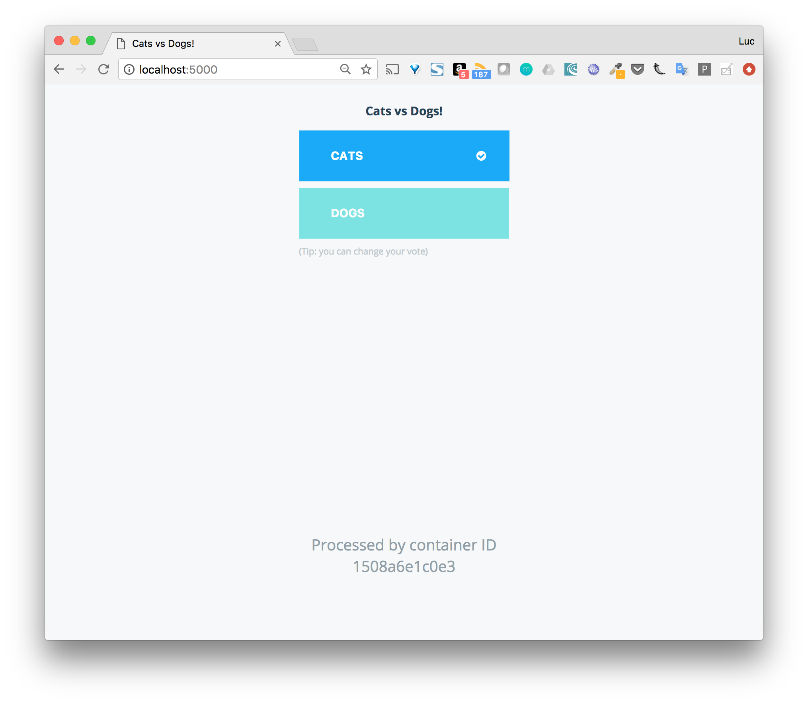
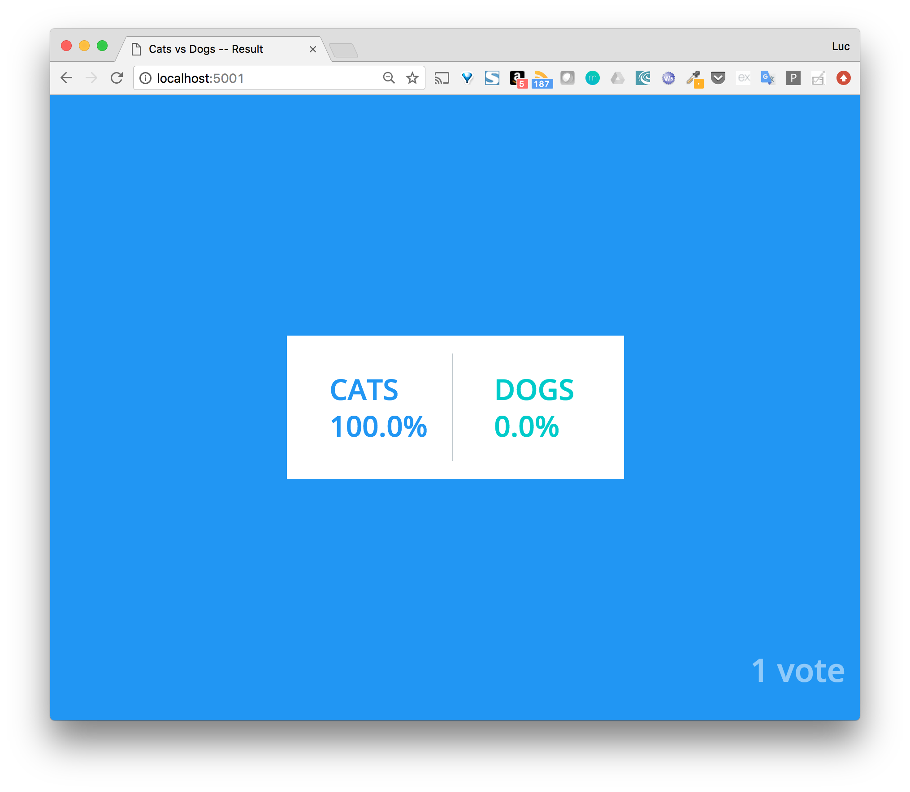

# Voting application

Dans ce lab, nous allons illustrer l’utilisation de Docker Compose et lancer l’application Voting App de Docker. Cette application est très utilisée pour des présentations et démos.

## Vue d’ensemble

L’application Voting App est une application micro-services composées de 5 services.


* vote: front-end permettant à un utilisateur de voter entre 2 options
* redis: database redis dans laquelle sont stockés les votes
* worker: service qui récupère les votes depuis redis et met les résultats dans une database postgres
* db: database postgres dans laquelle sont stockés les résultats
* result: front-end permettant de visualser les résutlats

## Clone du repository GitHub

Avec les commandes ci-dessous, récupérez le code de l’application depuis le repository GitHub.

```
$ git clone https://github.com/docker/example-voting-app    
$ cd example-voting-app
```

## docker-compose.yml

Plusieurs fichiers, au format Docker Compose, sont disponibles. Chacun décrivant l’application avec une complexitée plus ou moins importante..

Nous utilisons ici le fichier docker-compose.yml qui est le fichier par défaut.

```
version: "3"
services:
  vote:
    build: ./vote
    command: python app.py
    volumes:
     - ./vote:/app
    ports:
      - "5000:80"
    networks:
      - front-tier
      - back-tier
  result:
    build: ./result
    command: nodemon --debug server.js
    volumes:
      - ./result:/app
    ports:
      - "5001:80"
      - "5858:5858"
    networks:
      - front-tier
      - back-tier
  worker:
    build: ./worker
    networks:
      - back-tier
  redis:
    image: redis:alpine
    container_name: redis
    ports: ["6379"]
    networks:
      - back-tier
  db:
    image: postgres:9.4
    container_name: db
    volumes:
      - "db-data:/var/lib/postgresql/data"
    networks:
      - back-tier
volumes:
  db-data:
networks:
  front-tier:
  back-tier:
```

Ce fichier est très intéressant car il défini également des volumes et networks en plus des services.

Ce n’est cependant pas un fichier destiné à être lancé en production car pour les services vote, result et worker il utilise le code local et non des images releasées.

## Lancement de l’application

Lancer l’application à partir du fichier docker-compose.yml est très simple, il suffit de lancer la commande suivante:

```
$ docker-compose up -d
```

Note: avec l’option -d, l’application est lancée en background.

Vous obtiendrez un résultat similaire à celui ci-dessous (vous n'aurez cependant pas les mêmes identifiants)

```
Creating network "examplevotingapp_front-tier" with the default driver
Creating network "examplevotingapp_back-tier" with the default driver
Creating volume "examplevotingapp_db-data" with default driver
Building vote
...
Successfully built 132dbb3a7da7
WARNING: Image for service vote was built because it did not already exist. To rebuild this image you must use `docker-compose build` or `docker-compose up --build`.
Building worker
...
Successfully built 1fd182d05dc0
WARNING: Image for service worker was built because it did not already exist. To rebuild this image you must use `docker-compose build` or `docker-compose up --build`.
Pulling redis (redis:alpine)...
Status: Downloaded newer image for redis:alpine
Pulling db (postgres:9.4)...
Status: Downloaded newer image for postgres:9.4
Building result
...
Successfully built b83b544a167c
WARNING: Image for service result was built because it did not already exist. To rebuild this image you must use `docker-compose build` or `docker-compose up --build`.
Creating examplevotingapp_result_1
Creating examplevotingapp_worker_1
Creating examplevotingapp_vote_1
Creating redis
Creating db
```

Les étapes réalisées lors du lancement de l’application sont les suivantes:
* création du volume
* création des networks
* contruction des images pour les services custom (vote, worker, result) et récupération des images redis et postgres
* lancement de containers pour chaque service

## Les containers

Avec la commande suivane, listez les containers qui ont été lancés.

```
$ docker-compose ps
          Name                         Command               State                      Ports
-----------------------------------------------------------------------------------------------------------------
db                          docker-entrypoint.sh postgres    Up      5432/tcp
examplevotingapp_result_1   nodemon --debug server.js        Up      0.0.0.0:5858->5858/tcp, 0.0.0.0:5001->80/tcp
examplevotingapp_vote_1     python app.py                    Up      0.0.0.0:5000->80/tcp
examplevotingapp_worker_1   /bin/sh -c dotnet src/Work ...   Up
redis                       docker-entrypoint.sh redis ...   Up      0.0.0.0:32768->6379/tcp
```

## Les volumes

Listez les volumes avec la CLI, et vérifiez que le volume défini dans le fichier docker-compose.yml est présent.

```
$ docker volume ls
```

Le nom du volume est prefixé par le nom du répertoire dans lequel l’application a été lancée.

```
DRIVER              VOLUME NAME
local               examplevotingapp_db-data
```

Le nom du volume est préfixé par le répertoire dans lequel le fichier Compose est présent.

## Les networks

Listez les networks avec la CLI. Les deux networks définis dans le fichier docker-compose.yml sont présents.

```
$ docker network ls
```

De même que pour le volume, leur nom est préfixé par le nom du répertoire.

```
NETWORK ID          NAME                          DRIVER              SCOPE
38b004826b88        bridge                        bridge              local
07e7d2fca1bf        examplevotingapp_back-tier    bridge              local
ed12232eead5        examplevotingapp_front-tier   bridge              local
cfb848586437        host                          host                local
42843cd0d2cf        none                          null                local
```

Note: comme nous sommes dans le contexte d’un hôte unique (et non dans le contexte d’un cluster Swarm), le driver utilisé pour la création de ces networks est du type bridge. Il permet la communication entre les containers tournant sur une même machine..

## Utilisation de l’application

Nous pouvons maintenant accéder à l’application:

nous effectuons un choix entre les 2 options depuis l'interface de vote à l'adresse http://localhost:5000.
Si vous avez lancé cette application sur un autre hôte que votre machine, vous aurez accès à cette interface à l'adresse http://HOST:5000



nous visualisons le résultat depuis l'interface de résultats à l'adresse http://localhost:5001
Si vous avez lancé cette application sur un autre hôte que votre machine, vous aurez accès à cette interface à l'adresse http://HOST:5001



## Scaling du service worker

Par défaut, un container est instantié pour chaque service. Il est possible, avec la commande scale de changer ce comportement et de scaler un service une fois qu’il est lancé.

Avec la commande suivante, augmenter le nombre de worker à 2.

```
$ docker-compose scale worker=2
Starting examplevotingapp_worker_1 ... done
Creating examplevotingapp_worker_2 ...
Creating examplevotingapp_worker_2 ... done
```

Listez les containers présent. Les 2 containers relatifs au service worker sont présent.

```
$ docker-compose ps
          Name                         Command                State                        Ports
--------------------------------------------------------------------------------------------------------------------
db                          docker-entrypoint.sh postgres    Up         5432/tcp
examplevotingapp_result_1   nodemon --debug server.js        Up         0.0.0.0:5858->5858/tcp, 0.0.0.0:5001->80/tcp
examplevotingapp_vote_1     python app.py                    Up         0.0.0.0:5000->80/tcp
examplevotingapp_worker_1   /bin/sh -c dotnet src/Work ...   Up
examplevotingapp_worker_2   /bin/sh -c dotnet src/Work ...   Up
redis                       docker-entrypoint.sh redis ...   Up         0.0.0.0:32768->6379/tcp
```

Notes:
* il n’est pas possible de scaler les services vote et result car ils spécifient tous les 2 un port, plusieurs containers ne peuvent pas utiliser le même port de la machine hôte
* il n’est pas non plus possible de scaler les services db et redis car ils spécifient tous les 2 l’option container_name, plusieurs containers ne peuvent pas avoir le même nom.

```
$ docker-compose scale vote=3
...
ERROR: for examplevotingapp_vote_3  Cannot start service vote: driver failed programming external connectivity on endpoint examplevotingapp_vote_3 (b520da97c5736c46bfb2c80947fd2643387df0e0f67bbe18c226bad006dc940e): Bind for 0.0.0.0:5000 failed: port is already allocated
```

```
docker-compose scale redis=2
...
ERROR: for redis  Cannot create container for service redis: Conflict. The container name "/redis" is already in use by container "ff7ffbbebc3f4441a6b93c9a06389367b552b010bd62377931372ec2da0d4d59". You have to remove (or rename) that container to be able to reuse that name.
```

## Suppression de l’application

Avec la commande suivante, stoppez l’application. Cette commande supprime l’ensemble des éléments créés précédemment (volume et networks).

```
$ docker-compose down
Stopping examplevotingapp_vote_1 ... done
Stopping redis ... done
Stopping db ... done
Stopping examplevotingapp_worker_1 ... done
Stopping examplevotingapp_result_1 ... done
Removing examplevotingapp_vote_1 ... done
Removing redis ... done
Removing db ... done
Removing examplevotingapp_worker_1 ... done
Removing examplevotingapp_result_1 ... done
Removing network examplevotingapp_front-tier
Removing network examplevotingapp_back-tier
```

## Résumé

Cet exemple illustre l’utilisation de Docker Compose sur l’exemple bien connu de la Voting App dans le cadre d’un hôte unique. Pour déployer cette application sur un environnement de production, il faudrait effectuer des modifications dans le fichier docker-compose, par exemple:
* utilisation d’images pour les services
* ajout de service supplémentaires (aggregateur de logs, terminaison ssl, …)
* contraintes de deploiement
* ...
