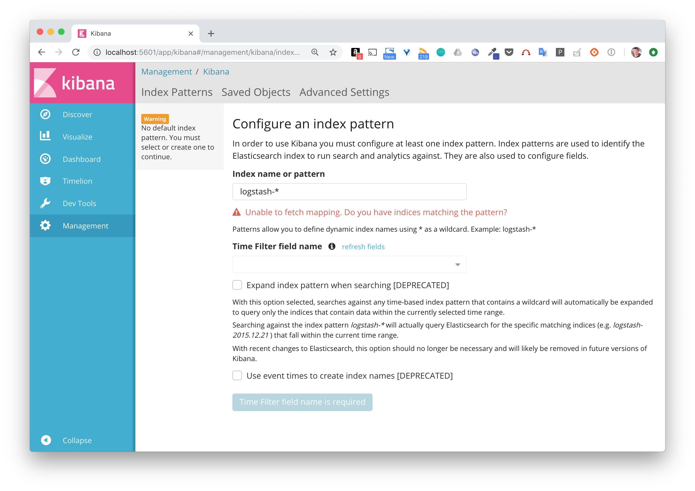
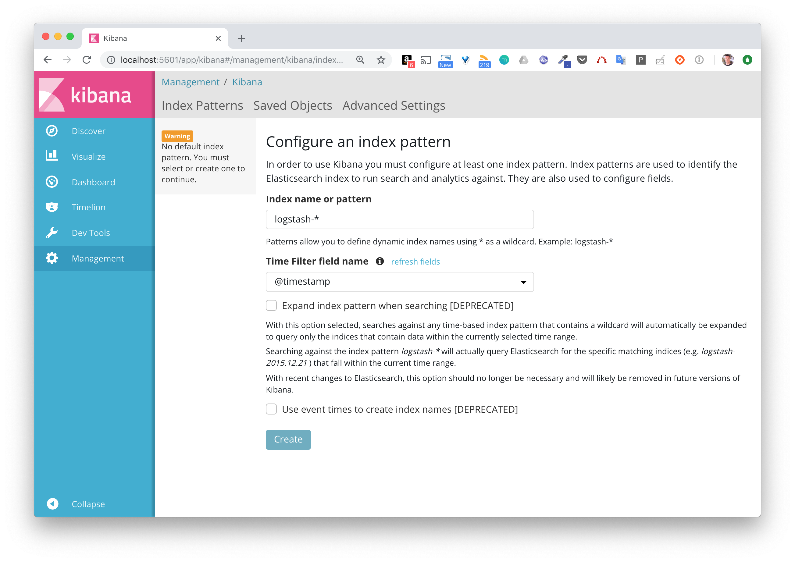
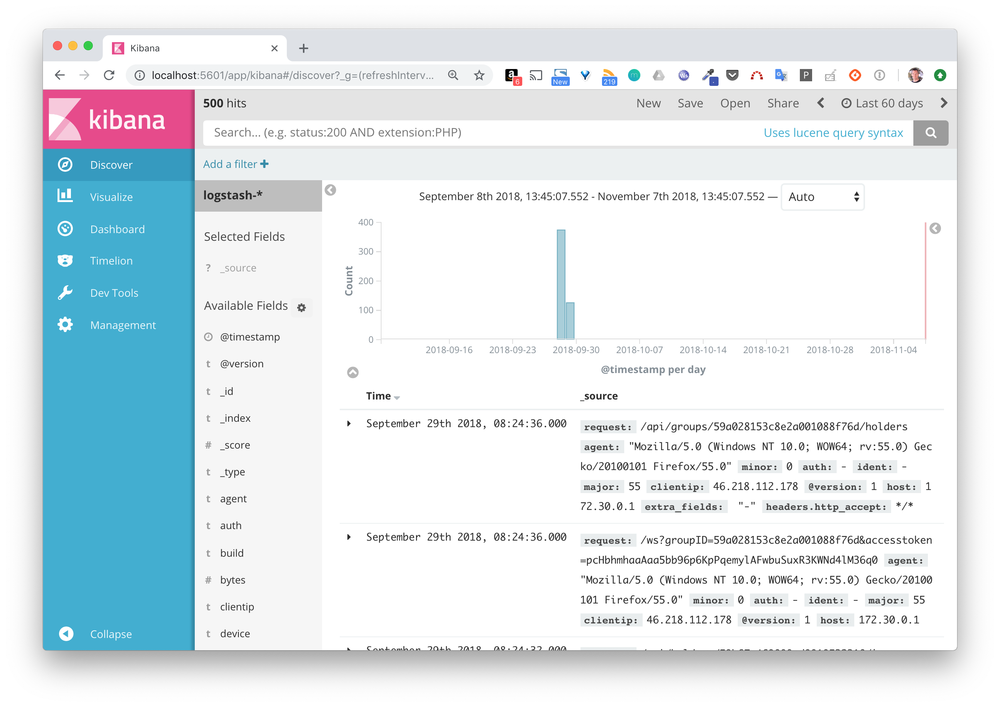
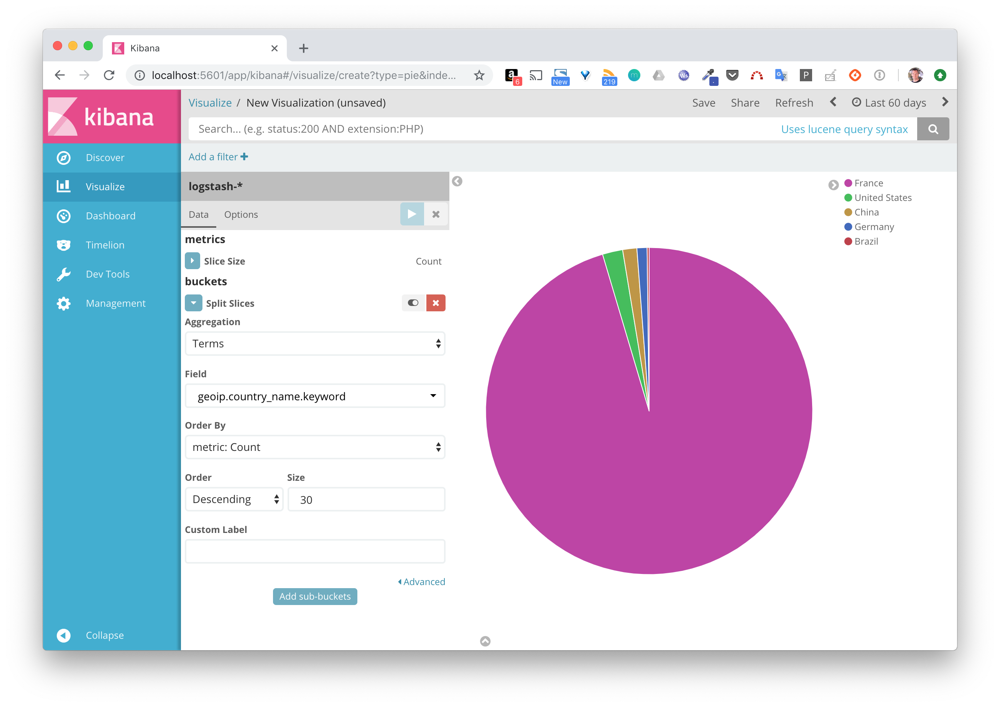

# La stack ELK (Elastic)

Cette stack est très souvent utilisée notamment pour ingérer et indexer des logs. Elle est composée de 3 logiciels:
* Logstash qui permet de filtrer / formatter les données entrantes et de les envoyer à Elasticsearch (et à d'autres applications)
* Elasticsearch, le moteur responsable de l'indexation des données
* Kibana, l'application web permettant la visualisation des données

## Le but de cet exemple

Dans cet exemple, nous allons utiliser Docker Compose pour lancer une stack ELK en configurant Logstash de façon à :
- ce qu'il puisse recevoir des entrées de log sur un endpoint HTTP
- extraire le champs présent dans chaque entrée et ajouter des informations de reverse geocoding
- envoyer chaque ligne dans Elasticsearch

L'interface de Kibana nous permettra de visualiser les logs et de créer des dashboards.

Note: nous considérerons que les fichiers de log sont générés par un serveur web comme apache / nginx, cela nous sera utile pour spécifier la façon dont Logstash doit réaliser le parsing.


## Définition de l'application dans un fichier au format Compose

Afin de définir notre stack ELK, créez un répertoire *elk* et, à l'intérieur de celui-ci, le fichier docker-compose.yml avec le contenu suivant:

```
version: '3.3'
services:
  logstash:
    image: logstash:5.5.2
    volumes:
      - ./logstash.conf:/config/logstash.conf
    command: ["logstash", "-f", "/config/logstash.conf"]
    ports:
      - 8080:8080
  elasticsearch:
    image: elasticsearch:5.5.2
    environment:
      - "ES_JAVA_OPTS=-Xms512m -Xmx512m"
  kibana:
    image: kibana:5.5.2
    ports:
      - 5601:5601
```

Note:

Le service Logstash est basé sur l'image officielle logstash:5.5.2.
Nous précisons sous la clé volumes le fichier de configuration logstash.conf présent dans le répertoire est monté sur /config/logstash.conf dans le container afin d'être pris en compte au démarrage

Le service Elasticseach est basé sur l'image officielle elasticsearch:5.5.2. La variable d'environnement ES_JAVA_OPTS est spécifiée dans le service elasticsearch afin de limiter la consommation en resource

Le service Kibana est basé sur l'image officielle kibana:5.5.2. Le mapping de port permettra à l'interface web d'être disponible sur le port 5601 de la machine hôte.

## Fichier de configuration de Logstash

Afin de pouvoir indexer des fichiers de logs existant, nous allons configurer Logstash. Dans le réperoire *elk* (ou se trouve le fichier docker-compose.yml), créez le fichier logstash.conf avec le contenu suivant

```
input {
 http {}
}

filter {
 grok {
   match => [ "message" , "%{COMBINEDAPACHELOG}+%{GREEDYDATA:extra_fields}"]
   overwrite => [ "message" ]
 }
 mutate {
   convert => ["response", "integer"]
   convert => ["bytes", "integer"]
   convert => ["responsetime", "float"]
 }
 geoip {
   source => "clientip"
   target => "geoip"
   add_tag => [ "nginx-geoip" ]
 }
 date {
   match => [ "timestamp" , "dd/MMM/YYYY:HH:mm:ss Z" ]
   remove_field => [ "timestamp" ]
 }
 useragent {
   source => "agent"
 }
}

output {
 elasticsearch {
   hosts => ["elasticsearch:9200"]
 }
 stdout { codec => rubydebug }
}
```

Ce fichier peu sembler un peu compliqué. Il peut être découpé en 3 parties:
* input: permet de spécifier les données d'entrée. Nous spécifions ici que logstash peut recevoir des données (entrées de logs)  sur du http

* filter: permet de spécifier comment les données d'entrée doivent être traitées avant de passer à l'étape suivante. Plusieurs instructions sont utilisées ici:
  * grok permet de spécifier comment chaque entrée doit être parsée. De nombreux parseurs sont disponibles par défaut et nous spécifions ici (avec COMBINEDAPACHELOG) que chaque ligne doit être parsée suivant un format de log apache, cela permettra une extraction automatique des champs comme l'heure de création, l'url de la requête, l'ip d'origine, le code retour, ...
  * mutate permet de convertir les types de certains champs
  * geoip permet d'obtenir des informations géographique à partir de l'adresse IP d'origine
  * date est utilisée ici pour reformatter le timestamp

* output: permet de spécifier la destination d'envoi des données une fois que celles-ci sont passées par l'étape filter

## Lancement de la stack ELK

Lancez la stack ELK avec la commande suivante

```
$ docker-compose up -d
Creating network "elk_default" with the default driver
Pulling elasticsearch (elasticsearch:5.5.2)...
5.5.2: Pulling from library/elasticsearch
219d2e45b4af: Pull complete
a482fbcfe407: Pull complete
980edaaff53b: Pull complete
288ffe538f2f: Pull complete
017932737cd4: Pull complete
28b38dddf546: Pull complete
92aff82bd83f: Pull complete
b08144fb654d: Pull complete
14ed224fb73f: Pull complete
f478c95dec23: Pull complete
5f9ae4a86d71: Pull complete
f822bfcfdea9: Pull complete
98d9d4b54ad0: Pull complete
47b728c174e9: Pull complete
9a2de73c3385: Pull complete
Digest: sha256:3686a5757ed46c9dbcf00f6f71fce48ffc5413b193a80d1c46a21e7aad4c53ad
Status: Downloaded newer image for elasticsearch:5.5.2
Pulling logstash (logstash:5.5.2)...
5.5.2: Pulling from library/logstash
219d2e45b4af: Already exists
a482fbcfe407: Already exists
980edaaff53b: Already exists
288ffe538f2f: Already exists
017932737cd4: Already exists
28b38dddf546: Already exists
92aff82bd83f: Already exists
b08144fb654d: Already exists
b8d29bf120da: Pull complete
49e4e007d02f: Pull complete
9e166f659798: Pull complete
1cab00742484: Pull complete
6f3222fb2dff: Pull complete
0324209cde1f: Pull complete
998889940a16: Pull complete
0cf6dea86193: Pull complete
Digest: sha256:6d5236d5a2371af15d19300f80be7e742e4fa15a19335c6a1372e685e803bc70
Status: Downloaded newer image for logstash:5.5.2
Pulling kibana (kibana:5.5.2)...
5.5.2: Pulling from library/kibana
aa18ad1a0d33: Pull complete
fa2d2a20bb84: Pull complete
667931c73e5d: Pull complete
7e8919cd44f8: Pull complete
e5d237d4fd33: Pull complete
c28d9cc6e097: Pull complete
47cc615b83bf: Pull complete
9abde8e46c89: Pull complete
9d6f193cf5a9: Pull complete
Digest: sha256:a121bbf35425bb7d3448feae3211cdbfdfa128f0f7301bdb5dc82a0a91edb885
Status: Downloaded newer image for kibana:5.5.2
Creating elk_elasticsearch_1 ...
Creating elk_elasticsearch_1 ... done
Creating elk_kibana_1 ...
Creating elk_logstash_1 ...
Creating elk_kibana_1
Creating elk_logstash_1 ... done
```

Une fois les images téléchargées (depuis le Docker Hub), le lancement de l'application peut prendre quelques secondes.

L'interface web de Kibana est alors accessible sur le port 5601 de la machine hôte.



Nous obtenons un message d'erreur car il n'y a pas encore de données dans Elasticsearch, Kibana n'est pas en mesure de détecter un index.

## Utilisation d'un fichier de logs de test

Nous allons maintenant utiliser un fichier de log de test et envoyer son contenu dans Logstash, contenu qui sera donc filtrer et envoyé à Elasticsearch.

Récupérez en local le fichier nginx.log avec la commande suivante :

```
curl -s -o nginx.log https://gist.githubusercontent.com/lucj/d9f08c3e40473e0555ffb2e16f1195b1/raw
```

Ce fichier contient 500 entrées de logs au format Apache. Par exemple, la ligne suivante correspond à une requête :
- reçue le 28 septembre 2018
- de type GET
- appelant l'URL https://mydomain.net/api/object/5996fc0f4c06fb000f83b7
- depuis l'adresse IP 46.218.112.178
- et depuis un navigateur Firefox

```
46.218.112.178 - - [28/Sep/2018:15:40:04 +0000] "GET /api/object/5996fc0f4c06fb000f83b7 HTTP/1.1" 200 501 "https://mydomain.net/map" "Mozilla/5.0 (Windows NT 10.0; WOW64; rv:55.0) Gecko/20100101 Firefox/55.0" "-"
```

On utilise alors la commande suivante pour envoyer chaque ligne à Logstash:

```
while read -r line; do curl -s -XPUT -d "$line" http://localhost:8080 > /dev/null; done < ./nginx.log
```

Une fois le script terminé, rafraichissez l'interface de Kibana, nous devriez voir que le message d'erreur précédent n'apparait plus car il y a maitenant des logs qui ont été indéxés par Elasticsearch et qui sont visibles par Kibana.



Cliquez sur Create afin de créer un pattern permettant d'identifier l'index que Elasticsearch a créé lors du traitement des entrées de logs. Cliquez ensuite sur Discover dans le menu de droite. Assurez vous d'avoir une période de recherche assez large afin de couvrir la date de l'entrée que nous avons spécifiée, vous pouvez configurer cette période en haut à droite de l'interface.



A partir de ces données, nous pouvons par exemple créer une visualisation permettant de lister les pays d'ou proviennent ces requêtes.



En allant un peu plus loin, nous pouvons, pour chaque pays, faire un découpage supplémentaire sur le code retour de la requête.


Nous pourrions ensuite, grace aux filtres, voir de quels pays proviennent les requêtes dont le code de retour est 401 (Unauthorized).

## En résumé

Nous avons vu ici une nouvelle fois la puissance et la facilité d'utilisation de Docker Compose. En peu de temps nous avons déployé et utilisé une stack ELK. Bien sur, ce que l'on a vu ici n'est qu'un aperçu. Je vous invite à utiliser d'autres fichiers de log, à modifier la configuration de logstash, à créer d'autres visualisation et des dashboard regroupant plusieurs visualisations. Cela vous permettra de découvrir d'autres fonctionnalités parmi les nombreuses qui sont disponibles.
