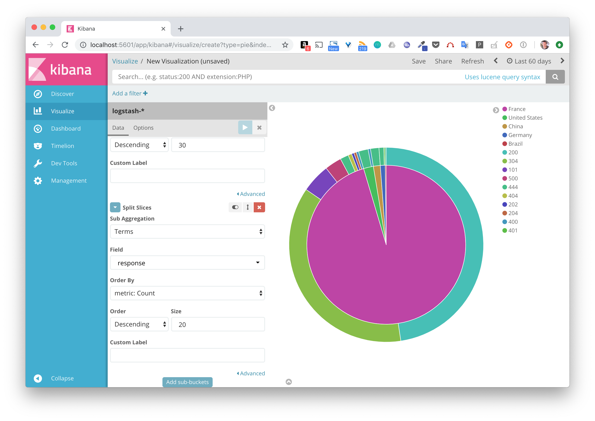

# La stack ELK

Cette stack est très souvent utilisée notamment pour ingérer et indexer des logs. Elle est composée de 3 logiciels:
* Logstash qui permet de filtrer / formatter les données entrantes et de les envoyer à Elasticsearch (et à d'autres applications)
* Elasticsearch, le moteur responsable de l'indexation des données
* Kibana, l'application web permettant la visualisation des données

## Le but de cet exemple

Dans cet exemple, nous allons utiliser Docker Compose pour lancer une stack ELK et configurer Logstash de façon à parser les fichiers de logs présent dans un répertoire défini et à envoyer chaque ligne dans Elasticsearch. L'interface de Kibana nous permettra de visualiser les logs et de créer des dashboards. 

Nous considérerons que les fichiers de log sont générés par un serveur web comme apache / nginx, cela nous sera utile pour spécifier la façon dont Logstash doit réaliser le parsing.


## Définition de l'application dans un fichier au format Compose

Afin de définir notre stack ELK, créez un répertoire *elk* et, à l'intérieur de celui-ci, le fichier docker-compose.yml avec le contenu suivant:

```
version: '3.3'
services:
  logstash:
    image: logstash:5.5.2
    depends_on:
      - elasticsearch
    volumes:
      - ./logstash.conf:/config/logstash.conf
      - ./log:/var/log:ro
    command: ["logstash", "-f", "/config/logstash.conf"]
  elasticsearch:
    image: elasticsearch:5.5.2
    environment:
      - "ES_JAVA_OPTS=-Xms512m -Xmx512m"
    ports:
      - 9200:9200
  kibana:
    image: kibana:5.5.2
    depends_on:
      - elasticsearch
    ports:
      - 5601:5601
```

Note:

Le service Logstash est basé sur l'image officielle logstash:5.5.2.
Nous précisons 2 entrées sous la clé volumes:
* le fichier de configuration logstash.conf présent dans le répertoire est monté sur /config/logstash.conf dans le container afin d'être pris en compte au démarrage
* le répertoire local log est monté dans /var/log cela nous permettra d'utiliser des fichiers de logs de test en local

Le service Elasticseach est basé sur l'image officielle elasticsearch:5.5.2. La variable d'environnement ES_JAVA_OPTS est spécifiée dans le service elasticsearch afin de limiter la consommation en resource

Le service Kibana est basé sur l'image officielle kibana:5.5.2. Le mapping de port permettra à l'interface web d'être disponible sur le port 5601 de la machine hôte. 

## Fichier de configuration de Logstash

Afin de pouvoir indexer des fichiers de logs existant, nous allons configurer Logstash. Dans le réperoire *elk* (ou se trouve le fichier docker-compose.yml), créez le fichier logstash.conf avec le contenu suivant

```
input {
 file {
   path => ["/var/log/*.log"]
   start_position => "beginning"
   type => "nginx"
 }
}
filter {
 grok {
   match => [ "message" , "%{COMBINEDAPACHELOG}+%{GREEDYDATA:extra_fields}"]
   overwrite => [ "message" ]
 }
 mutate {
   convert => ["response", "integer"]
   convert => ["bytes", "integer"]
   convert => ["responsetime", "float"]
 }
 geoip {
   source => "clientip"
   target => "geoip"
   add_tag => [ "nginx-geoip" ]
 }
 date {
   match => [ "timestamp" , "dd/MMM/YYYY:HH:mm:ss Z" ]
   remove_field => [ "timestamp" ]
 }
 useragent {
   source => "agent"
 }
}
output {
 elasticsearch {
   hosts => ["elasticsearch:9200"]
 }
 stdout { codec => rubydebug }
}
```

Ce fichier est un petit peu compliqué, mais il peut être décomposé en 3 parties:
* input: permet de spécifier les données d'entrée. Nous spécifions ici que tous les fichiers avec l'extension .log présent dans le répertoire /var/log (du container) seront pris en compte, ces fichiers seront donc les fichiers présent dans le répertoire log en local

* filter: permet de spécifier comment les données d'entrée doivent être traitées avant de passer à l'étape suivante. Plusieurs instructions sont utilisées ici. grok permet de spécifier comment chaque entrée doit être parsée. De nombreux parseurs sont disponibles par défaut et nous spécifions ici (avec COMBINEDAPACHELOG) que chaque ligne doit être parsée suivant un format de log apache, cela permettra une extraction automatique des champs comme l'heure de création, l'url de la requête, l'ip d'origine, le code retour, ...  Mutate permet de convertir les types de certains champs. geoip permet d'obtenir des informations géographique à partir de l'adresse IP d'origine. date est utilisée ici pour reformatter le timestamp

* output: permet de spécifier la destination d'envoi des données une fois que celles-ci sont passées par l'étape filter

## Lancement de la stack ELK

Lancez la stack ELK avec la commande suivante

```
$ docker-compose up -d
Creating network "elk_default" with the default driver
Pulling elasticsearch (elasticsearch:5.5.2)...
5.5.2: Pulling from library/elasticsearch
219d2e45b4af: Pull complete
a482fbcfe407: Pull complete
980edaaff53b: Pull complete
288ffe538f2f: Pull complete
017932737cd4: Pull complete
28b38dddf546: Pull complete
92aff82bd83f: Pull complete
b08144fb654d: Pull complete
14ed224fb73f: Pull complete
f478c95dec23: Pull complete
5f9ae4a86d71: Pull complete
f822bfcfdea9: Pull complete
98d9d4b54ad0: Pull complete
47b728c174e9: Pull complete
9a2de73c3385: Pull complete
Digest: sha256:3686a5757ed46c9dbcf00f6f71fce48ffc5413b193a80d1c46a21e7aad4c53ad
Status: Downloaded newer image for elasticsearch:5.5.2
Pulling logstash (logstash:5.5.2)...
5.5.2: Pulling from library/logstash
219d2e45b4af: Already exists
a482fbcfe407: Already exists
980edaaff53b: Already exists
288ffe538f2f: Already exists
017932737cd4: Already exists
28b38dddf546: Already exists
92aff82bd83f: Already exists
b08144fb654d: Already exists
b8d29bf120da: Pull complete
49e4e007d02f: Pull complete
9e166f659798: Pull complete
1cab00742484: Pull complete
6f3222fb2dff: Pull complete
0324209cde1f: Pull complete
998889940a16: Pull complete
0cf6dea86193: Pull complete
Digest: sha256:6d5236d5a2371af15d19300f80be7e742e4fa15a19335c6a1372e685e803bc70
Status: Downloaded newer image for logstash:5.5.2
Pulling kibana (kibana:5.5.2)...
5.5.2: Pulling from library/kibana
aa18ad1a0d33: Pull complete
fa2d2a20bb84: Pull complete
667931c73e5d: Pull complete
7e8919cd44f8: Pull complete
e5d237d4fd33: Pull complete
c28d9cc6e097: Pull complete
47cc615b83bf: Pull complete
9abde8e46c89: Pull complete
9d6f193cf5a9: Pull complete
Digest: sha256:a121bbf35425bb7d3448feae3211cdbfdfa128f0f7301bdb5dc82a0a91edb885
Status: Downloaded newer image for kibana:5.5.2
Creating elk_elasticsearch_1 ...
Creating elk_elasticsearch_1 ... done
Creating elk_kibana_1 ...
Creating elk_logstash_1 ...
Creating elk_kibana_1
Creating elk_logstash_1 ... done
```

Une fois les images téléchargées (depuis le Docker Hub), le lancement de l'application peut prendre quelques secondes.

L'interface web de Kibana est alors accessible sur le port 5601 de la machine hôte.


Nous obtenons un message d'erreur car pour le moment aucun fichier n'a été traité, il n'y en a aucun dans le répertoire /var/log du container Logstash car le répertoire log local est vide.


## Utilisation d'un fichier de logs de test


Dans le répertoire *elk*, créez le répertoire *log* et à l'intérieur de celui-ci, créez le fichier *nginx-simple.log* contenant simplement la ligne suivante (celle-ci correspond à la réception d'une requête GET appelant l'URL /api/object/5996fc0f4c06fb000f83b7 depuis l'adresse IP 46.218.112.178):

```
46.218.112.178 - - [28/Sep/2017:15:40:04 +0000] "GET /api/object/5996fc0f4c06fb000f83b7 HTTP/1.1" 200 501 "https://mydomain.net/map" "Mozilla/5.0 (Windows NT 10.0; WOW64; rv:55.0) Gecko/20100101 Firefox/55.0" "-" 
```

Si nous regardons les logs du service logstash, nous pouvons voir le traitement de ce fichier

```
$ docker-compose logs logstash
...
logstash_1       | 15:34:19.830 [Api Webserver] INFO  logstash.agent - Successfully started Logstash API endpoint {:port=>9600}
logstash_1       | {
logstash_1       |          "request" => "/api/object/5996fc0f4c06fb000f83b7",
logstash_1       |            "agent" => "\"Mozilla/5.0 (Windows NT 10.0; WOW64; rv:55.0) Gecko/20100101 Firefox/55.0\"",
logstash_1       |            "minor" => "0",
logstash_1       |             "auth" => "-",
logstash_1       |            "ident" => "-",
logstash_1       |             "type" => "nginx",
logstash_1       |             "path" => "/var/log/nginx.log",
logstash_1       |            "major" => "55",
logstash_1       |         "clientip" => "46.218.112.178",
logstash_1       |         "@version" => "1",
logstash_1       |             "host" => "617682a982b9",
logstash_1       |     "extra_fields" => " \"-\"",
logstash_1       |            "geoip" => {
logstash_1       |               "timezone" => "Europe/Paris",
logstash_1       |                     "ip" => "46.218.112.178",
logstash_1       |               "latitude" => 48.8058,
logstash_1       |         "continent_code" => "EU",
logstash_1       |              "city_name" => "Alfortville",
logstash_1       |           "country_name" => "France",
logstash_1       |          "country_code2" => "FR",
logstash_1       |          "country_code3" => "FR",
logstash_1       |            "region_name" => "Val-de-Marne",
logstash_1       |               "location" => {
logstash_1       |             "lon" => 2.4204,
logstash_1       |             "lat" => 48.8058
logstash_1       |         },
logstash_1       |            "postal_code" => "94140",
logstash_1       |            "region_code" => "94",
logstash_1       |              "longitude" => 2.4204
logstash_1       |     },
logstash_1       |               "os" => "Windows 10",
logstash_1       |             "verb" => "GET",
logstash_1       |          "message" => "46.218.112.178 - - [28/Sep/2017:15:40:04 +0000] \"GET /api/object/5996fc0f4c06fb000f83b7 HTTP/1.1\" 200 501 \"https://mydomain.net/map\" \"Mozilla/5.0 (Windows NT 10.0; WOW64; rv:55.0) Gecko/20100101 Firefox/55.0\" \"-\"",
logstash_1       |             "tags" => [
logstash_1       |         [0] "nginx-geoip"
logstash_1       |     ],
logstash_1       |         "referrer" => "\"https://mydomain.net/map\"",
logstash_1       |       "@timestamp" => 2017-09-28T15:40:04.000Z,
logstash_1       |            "build" => "",
logstash_1       |         "response" => 200,
logstash_1       |            "bytes" => 501,
logstash_1       |             "name" => "Firefox",
logstash_1       |          "os_name" => "Windows 10",
logstash_1       |      "httpversion" => "1.1",
logstash_1       |           "device" => "Other"
logstash_1       | }
...
```

Rafraichissez l'interface de Kibana, nous devriez voir que le message d'erreur précédent n'apparait plus. Cela provient du fait que l'entrée présente dans notre fichier a été traitée.


Cliquez sur Create afin de créer un pattern permettant d'identifier l'index que Elasticsearch a créé pour nous lors du traitement de notre unique entrée. Cliquez ensuite sur Discover dans le menu de droite. Assurez vous d'avoir une période de recherche assez large afin de couvrir la date de l'entrée que nous avons spécifiée, vous pouvez configurer cette période en haut à droite de l'interface.


L'intérêt de la stack ELK n'est bien sur pas d'indexer une entrée de logs mais des centaines de milliers / millions.

## Exemple avec un fichier de log réel

Si l'on copie dans le répertoire log un fichier contenant de nombreux enregistrements (de nombreuses lignes) aux format apache / nginx, nous serons capable de faire des recherches, de construire des dashboard business et d'en retirer des statistiques intéressantes.

Utilisez le fichier *nginx-full.log* et placez le dans le répertoir *log* que vous avez créez. Visualisez les entrées de logs qui sont indexées et manipulez les comme vous le souhaitez.

L'exemple suivante montre l'indexation du contenu du fichier *nginx-full.log* comportant plusieurs milliers d'enregistrement.


A partir de ces données, nous avons créé une visualisation permettant de lister les pays d'origine des requêtes reçues. Pour chaque pays, nous avons un découpage en ville et pour chaque ville un découpage sur le code retour de la requête (peut-être pas très utile sur le plan business, mais la représentation est intéressante).



Nous pouvons par exemple voir le nombre de requêtes dont le code de retour est 101 et dont l'origine est Paris.


## En résumé

Nous avons vu ici une nouvelle fois la puissance et la facilité d'utilisation de Docker Compose. En peu de temps nous avons déployé et utilisé une stack ELK. Bien sur, ce que l'on a vu ici n'est qu'un aperçu de la stack ELK. Je vous invite à utiliser d'autres fichiers de log, à modifier la configuration de logstash, à créer d'autres visualisation et des dashboard regroupant plusieurs visualisations. Cela vous permettra de découvrir d'autres fonctionnalités parmi les nombreuses qui sont disponibles.
