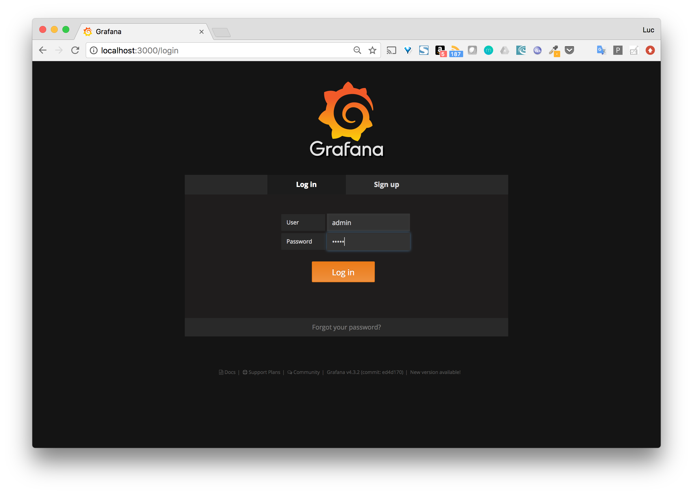
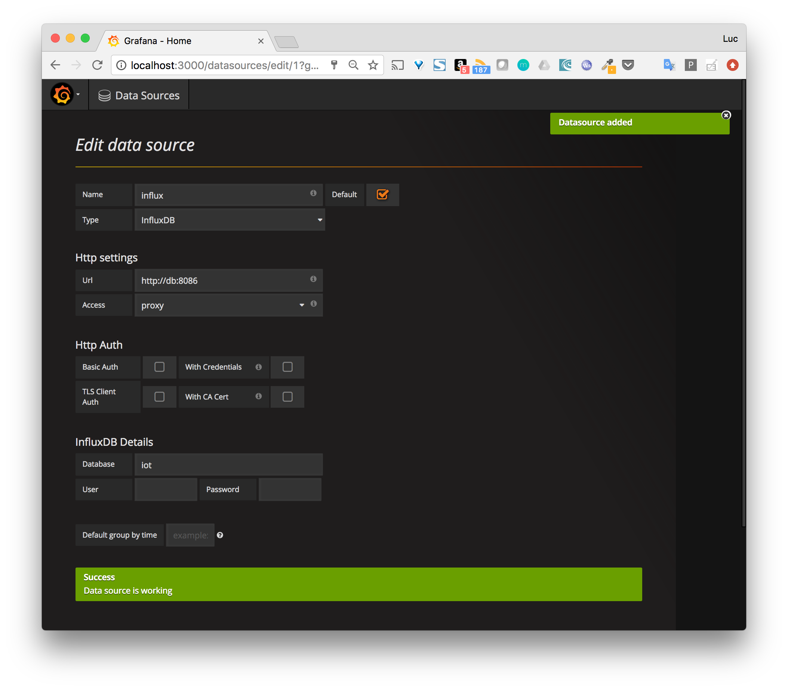
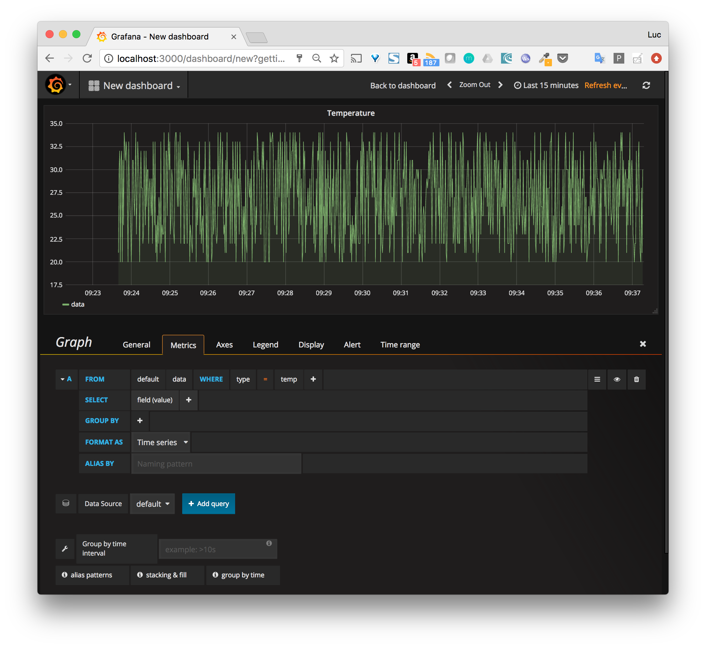
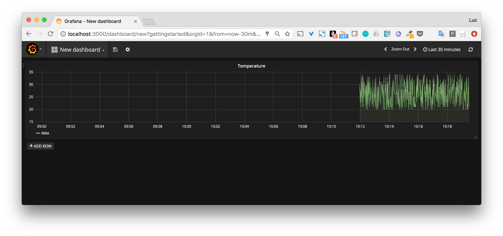

## Création d'une application Compose

Dans ce lab, nous allons créer une application simple composée de plusieurs “micro-services”. Dans un premier temps, nous lancerons les éléments de cette application manuellement dans des containers. Dans un second temps nous définirons l’application avec Docker Compose.

Attention: cet exemple est basé sur le projet https://github.com/lucj/IoT-demo-project qui est utilisé pour illustrer plusieurs chapitres de ce cours. Si vous suivez le projet, il n'est pas nécessaire de faire cet exercice car cela sera redondant. Dans le cas contraire, cet exercice vous donnera un bon résumé du projet.

## L’application

L’application a pour but de simuler l’envoi de données par une device IoT ainsi que la réception / sauvegarde / visualisation de ces données.

Elle est composée des éléments suivants:
* un simulateur (qui simule une device IoT), celui-ci génère des données aléatoires et les envoie via http
* un collecteur en charge de la réception et du stockage des données
* une base de données utilisée pour la persistance des données
* un dashboard de visualisation

## Le simulateur

Le code de ce composant est disponible sur le repository GitHub lucj/iot-simulateur

C’est un simple script shell qui:
* récupère la date courante
* génère une valeur aléatoire qui simule une température
* envoie un payload au serveur dont l’URL et le port sont passés en paramètre

Le code de ce script est le suivant:

```
#!/bin/sh

# Usage
function usage {
    echo "Usage: simulator.sh -h HOST -p PORT"
    exit 1
}

# Parse arguments
while getopts h:p: FLAG; do
  case $FLAG in
    h)
      HOST=$OPTARG
      ;;
    p)
      PORT=$OPTARG
      ;;
    \?)
      usage
      ;;
  esac
done

# Make sure HOST and PORT are specified
if [ -z "$HOST" -o -z "$PORT" ]; then
   usage
fi

# Generate and send random data
while(true); do
    # Current date
    d=$(date -u +"%Y-%m-%dT%H:%M:%SZ")

    # Random temperature between 20 and 34°C
    temp=$(( ( RANDOM % 15 )  + 20 ))

    # Send data to specified HOST:PORT
    data='{"ts":"'$d'", "type": "temp", "value": '$temp', "sensor_id": 123 }'

    curl -XPOST -H "Content-Type: application/json" -d "$data" http://$HOST:$PORT/data

    sleep 1
done
```

Le payload envoyé à chaque itération a le format suivant:

```
{
  "ts":"2017-06-25T09:53:16Z",
  "type": "temp",
  "value": 34,
  "sensor_id": 123
}
```

Il simule les données que pourrait envoyer une device IoT, identifiée par son id (sensor_id).

## Le collecteur de données

Ce composant est développé avec la plateforme Node.js. Le code est disponible sur le repository GitHub lucj/iot-collector

Son rôle principal est d’exposer un endpoint en HTTP POST sur /data sur lequel les données de température, envoyées par le simulateur, sont reçues. Le collecteur est également en charge de sauvegarder les données dans une base InfluxDB. Le morceau de code ci-dessous illustre cette fonctionnalité.

```
...
app.post('/data',
         function(req, res, next){
             influx.writePoints([
                 {
                  measurement: 'data',
                  tags: { type: req.body.type },
                  fields: { sensor_id: req.body.sensor_id, value: req.body.value },
                  timestamp: new Date(req.body.ts).getTime() * 1000000
                 }
             ]).then(() => {
               winston.info(req.body);
               return res.sendStatus(201);
             })
             .catch( err => {
               winston.error(err.message);
               return res.sendStatus(500);
             });
         });
...
```

## La base de données

InfluxDB est la base de données utilisée par le collecteur pour sauvegarder les données reçues. C’est une base très performante pour le sauvegarde de données temporelles.

## Le dashboard

Grafana un outils qui s’intègre très facilement sur différentes sources de données (Prometheus, InfluxDB, …) et qui permet de créer des dashboards de très bonne qualité.

## Lancement de l’application

Dans un premier temps, nous allons lancer les différents services de l’application manuellement dans des containers. Afin que les services puissent communiquer entre eux, nous allons créer un réseau bridge (user-defined bridge) et attacher chacun des containers à ce réseau.

### Création du network

Créez le réseau mynet, de type bridge, avec la commande suivante: 

```
$ docker network create mynet
```

Note: nous verrons les networks en details dans un labs dédié. Pour le moment nous pouvons considérer un réseau comme un moyen d’isoler un groupe de containers leur permettant de communiquer entre eux.

### Lancement des services

Nous allons maintenant lancer un à un les composants de notre application dans des containers.

Chacun des containers:
* sera lancé en background
* sera attaché au network mynet crée précédemment

### La base de données

Nous utilisons l’image officielle de InfluxDB disponible dans le Docker Hub.

Utilisez la commande suivante pour lancez un container nommé db, attaché au network mynet et basé sur l'image InfluxDB. Nous publions en même temps le port 8086 afin d'avoir accès à la base de données depuis le port 8086 de la machine hôte.

```
$ docker container run -p 8086:8086 --net mynet --name db -d influxdb:1.3
```

Une fois le container lancé, créez la base de données iot dont nous aurons besoin plus tard.

```
$ curl -XPOST http://localhost:8086/query --data-urlencode "q=CREATE DATABASE iot"
{"results":[{"statement_id":0}]}
```

Vérifiez, au moyen de la commande suivante, que la base est bien créée.

```
$ curl -XPOST http://localhost:8086/query --data-urlencode "q=SHOW DATABASES" | jq
{
  "results": [
    {
      "statement_id": 0,
      "series": [
        {
          "name": "databases",
          "columns": [
            "name"
          ],
          "values": [
            [
              "iot"
            ],
            [
              "_internal"
            ]
          ]
        }
      ]
    }
  ]
}
```

### Le collecteur

Utilisez la commande suivante pour lancer un container, nommé collector, attaché au network mynet et basé sur l'image lucj/iot-collector:1.0

```
$ docker container run --net mynet --name collector -d lucj/iot-collector:1.0
```

Visualisez les logs de ce container avec la commande suivante:

```
$ docker container logs collector
```

A ce stade, nous pouvons seulement voir que le serveur web est lancé. Il est en attente de requêtes HTTP.

```
> iot@1.0.0 start /app
> node index.js

info: server listening on port 1337
```

### Le simulateur

Utilisez la commande suivante pour lancer un container, nommé simulator, attaché au network mynet et basé sur l'image lucj/iot-simulator:1.0. 

```
$ docker container run --net mynet --name simulator -d lucj/iot-simulator -h collector -p 1337
```

Note: nous précisons les options -h et -p afin que le simulateur puisse envoyer les données sur le container collector que nous avons lancé précédemment.

Visualisez les logs du simulateur à l'aide de la commande suivante

```
$ docker container logs -f simulator
```

Nous pouvons voir que le simulateur envoie des données et qu'elles sont créées correctement (le code retour est bien 201).

```
% Total    % Received % Xferd  Average Speed   Time    Time     Time  Current
                                 Dload  Upload   Total   Spent    Left  Speed
HTTP/1.1 201 Created
100    84  100     7  100    77    119   1313 --:--:-- --:--:-- --:--:--  1350
X-Powered-By: Express
Content-Type: text/plain; charset=utf-8
Content-Length: 7
ETag: W/"7-rM9AyJuqT6iOan/xHh+AW+7K/T8"
Date: Tue, 24 Oct 2017 07:07:51 GMT
Connection: keep-alive
  % Total    % Received % Xferd  Average Speed   Time    Time     Time  Current
                                 Dload  Upload   Total   Spent    Left  Speed
100    84  100     7  100    77    556   6125 --:--:-- --:--:-- --:--:--  7000
CreatedHTTP/1.1 201 Created
X-Powered-By: Express
Content-Type: text/plain; charset=utf-8
Content-Length: 7
ETag: W/"7-rM9AyJuqT6iOan/xHh+AW+7K/T8"
Date: Tue, 24 Oct 2017 07:07:52 GMT
Connection: keep-alive
...
```

Regardez une nouvelle fois les log du collector. Nous pouvons voir que chaque donnée envoyée par le simulateur apparait bien.

```
$ docker container logs -f collector
> iot@1.0.0 start /app
> node index.js
info: server listening on port 1337
info:  ts=2017-10-24T07:07:51Z, type=temp, value=32, sensor_id=123
info:  ts=2017-10-24T07:07:52Z, type=temp, value=30, sensor_id=123
...
```

### Le dashboard

Utilisez la commande suivante pour lancer un container nommé dashboard, attaché au network mynet et basé sur l'image grafana/grafana:4.3.2. L'option -p 3000:3000 permet de publier le port 3000 du container sur le port 3000 de la machine hôte.

```
$ docker container run -p 3000:3000 --net mynet --name dashboard -d grafana/grafana:4.3.2
```

Nous pouvons alors accéder à l'interface de Grafana sur http://localhost:3000. Vous pouvez vous connecter avec le compte admin / admin.



Vous allez commencer par ajouter une data source et la configurer comme présenté sur la copie d'écran suivante:
* le nom de la data source est influx
* le backend est InfluxDB
* url de connection à la base de données est http://db:8086. Nous utilisons le nom db car un container attaché au réseau mynet peut communiquer avec les autres containers du réseau simplement en utilisant leur nom, la résolution de nom étant effectuée par le daemon Docker
* le nom de la base est iot



Depuis le menu, vous pouvez ensuite créer un dashboard afin de visualiser les données.

L'exemple suivant défini une visualisation très simple avec un rafraichissement automatique toutes les 5 secondes afin de voir l’évolution de la courbe en quasi temps réel car le simulateur envoie des données en continu.



## Définition de l’application Compose

L’approche que nous avons utilisée ci-dessus peut devenir relativement compliquée et sujette à des erreurs dans le cas d’une application composée d’un grand nombre de services. Nous allons voir ici comment définir l’application en utilisant le format Docker Compose.

Créez un répertoire iot et, dans celui-ci, le fichier docker-compose.yml définissant les services db, dashboard, simulator et collector comme indiqué ci-dessous.

```
version: "3"
services:
  db:
    image: influxdb:1.3
    container_name: influx
    restart: on-failure
  dashboard:
    image: grafana/grafana:4.3.2
    ports:
      - 3000:3000
    restart: on-failure
  simulator:
    image: lucj/iot-simulator:1.0
    command: -h collector -p 1337
    restart: on-failure
  collector:
    image: lucj/iot-collector:1.0
    restart: on-failure
```

Pour chaque service, nous avons ajouté l’option restart: on-failure de façon à ce qu’un container soit relancé en cas de défaillance.

Lancez l'application avec la commande suivante:

```
$ docker-compose up -d
```

Listez les containers de l'application, les 4 containers devraient apparaitre comme ci-dessous.

```
$ docker-compose ps
      Name                    Command               State            Ports
-----------------------------------------------------------------------------------
iot_collector_1   npm start                        Up       1337/tcp
iot_dashboard_1   /run.sh                          Up       0.0.0.0:3000->3000/tcp
iot_db_1          /entrypoint.sh influxd           Up       8086/tcp
iot_simulator_1   /app/simulator.sh -h colle ...   Up
```

Un fois que les services de notre application sont lancés, nous devons créer la base de données afin que le collector puisse persister les données et que le dashboard puisse les lire. Pour cela lancez la commande suivante, celle-ci envoie une requête HTTP depuis l'intérieur du container influx.

```
$ docker exec influx curl -XPOST http://localhost:8086/query --data-urlencode "q=CREATE DATABASE iot"
{"results":[{"statement_id":0}]}
```

Note: nous avons spécifié l’option containe_name pour l’unique container du service db. Spécifier un nom de container pour un service ne permettra pas de scaler ce service (créer plusieurs containers) par la suite.

De la même manière que précédemment, vérifiez que la database a bien été créée

```
$ docker exec influx curl -XPOST http://localhost:8086/query --data-urlencode "q=SHOW DATABASES" | jq
  % Total    % Received % Xferd  Average Speed   Time    Time     Time  Current
                                 Dload  Upload   Total   Spent    Left  Speed
100   135    0   117  100    18  22396   3445 --:--:-- --:--:-- --:--:-- 23400
{
  "results": [
    {
      "statement_id": 0,
      "series": [
        {
          "name": "databases",
          "columns": [
            "name"
          ],
          "values": [
            [
              "_internal"
            ],
            [
              "iot"
            ]
          ]
        }
      ]
    }
  ]
}
```

Nous pouvons alors accéder à l'interface de Grafana sur http://localhost:3000 et effectuer la même configuration que précédemment.



Note: lorsque nous avons lancé les containers manuellement, nous avons crée un réseau et attaché chacun des containers à celui-ci. Lorsque l’on utilise Docker Compose, un réseau de type bridge est crée automatiquement et l’ensemble des containers de l'application y sont attachés. Ceci permet la communication entre les containers via le nom du service en utilisant le serveur DNS du daemon Docker.

Arrêtez l'application avec la commande suivante:

```
$ docker-compose down
```

Une fois l'application détruite, avec la commande down, les données stockées dans la base sont perdues car celles-ci ont été sauvegardées dans le container influx. Lorsqu'un container est supprimé toutes les données sauvegardées dans celui-ci (plus exactement dans la layer read-write du container) sont supprimées en même temps.

### Utilisation d’un volume

Afin de persister les données à l’extérieur du container influx, nous allons définir le volume nommé data dans le fichier docker-compose.yml. Pour cela nous faisons un mount de ce volume sur le répertoire /var/lib/influxdb du container car c’est dans ce répertoire que la base de données Influx conserve ses données.

Modifiez le fichier docker-compose.yml afin qu’il contienne la structure suivante.

```
version: "3"
services:
  db:
    image: influxdb
    container_name: influx
    volumes:
      - data:/var/lib/influxdb
    restart: on-failure
  dashboard:
    image: grafana/grafana
    ports:
      - 3000:3000
  simulator:
    image: lucj/iot-simulator
    command: -h collector -p 1337
  collector:
    image: lucj/iot-collector
volumes:
  data:
```

Lancez une nouvelle fois l'application avec la commande suivante.

```
$ docker-compose up -d
```

Comme vous l'avez fait précédemment, lancez la commande suivante afin de créer la base iot.

```
$ docker exec influx curl -XPOST http://localhost:8086/query --data-urlencode "q=CREATE DATABASE iot"
```

Listez les volumes et vérifier que le volume data a été crée.

```
$ docker volume ls | grep data
DRIVER              VOLUME NAME
local               iot_data
...
```

Note: par défaut, le nom de chaque composants d’une application Compose (networks, volumes, containers) est préfixé par le nom du répertoire courant (iot dans ce cas)

Inspectez le volume et récupérer son path sur la machine hôte.

```
$ docker volume inspect iot_data
[
    {
        "Driver": "local",
        "Labels": {
            "com.docker.compose.project": "iot",
            "com.docker.compose.volume": "data"
        },
        "Mountpoint": "/var/lib/docker/volumes/iot_data/_data",
        "Name": "root_data",
        "Options": {},
        "Scope": "local"
    }
]
```

Les données générées lors du lancement du service db sont stockées dans ce volume. 

**Note**: si vous êtes sur une machine Linux, vous pouvez lancer directement la commande suivante afin d'inspecter le contenu du volume iot_data sur le disque. Si vous êtes sur Docker for Mac ou Docker for Windows, il vous faudra tout d'abord lancer un shell sur la machine virtuelle (tournant respectivement sur xhyve ou Hyper-V) avec la commande suivante
**docker run -it --privileged --pid=host debian nsenter -t 1 -m -u -n -i sh**

Listez le contenu du répertoire utilisé par le volume iot_data avec la commande suivante:

```
$ find /var/lib/docker/volumes/iot_data/_data
/var/lib/docker/volumes/iot_data/_data
/var/lib/docker/volumes/iot_data/_data/data
/var/lib/docker/volumes/iot_data/_data/data/_internal
/var/lib/docker/volumes/iot_data/_data/data/_internal/monitor
/var/lib/docker/volumes/iot_data/_data/data/_internal/monitor/2
/var/lib/docker/volumes/iot_data/_data/data/iot
/var/lib/docker/volumes/iot_data/_data/data/iot/autogen
/var/lib/docker/volumes/iot_data/_data/data/iot/autogen/1
/var/lib/docker/volumes/iot_data/_data/wal
/var/lib/docker/volumes/iot_data/_data/wal/_internal
/var/lib/docker/volumes/iot_data/_data/wal/_internal/monitor
/var/lib/docker/volumes/iot_data/_data/wal/_internal/monitor/2
/var/lib/docker/volumes/iot_data/_data/wal/_internal/monitor/2/_00001.wal
/var/lib/docker/volumes/iot_data/_data/wal/iot
/var/lib/docker/volumes/iot_data/_data/wal/iot/autogen
/var/lib/docker/volumes/iot_data/_data/wal/iot/autogen/1
/var/lib/docker/volumes/iot_data/_data/wal/iot/autogen/1/_00001.wal
/var/lib/docker/volumes/iot_data/_data/meta
/var/lib/docker/volumes/iot_data/_data/meta/meta.db
```

Nous retrouvons alors les références à la base de données iot que nous avons créée et qui est utilisée pour persister les données reçu du simulateur.

## En résumé

Nous avons vu dans cet exercice comment utiliser Docker Compose pour la gestion d'une application multi-containers. Le binaire docker-compose permet de lancer une application sur un hôte unique, cependant le format du fichier docker-compose.yml peut également être utilisé dans le contexte d'un cluster Swarm comme nous le verrons plus tard avec la notion de stack.
