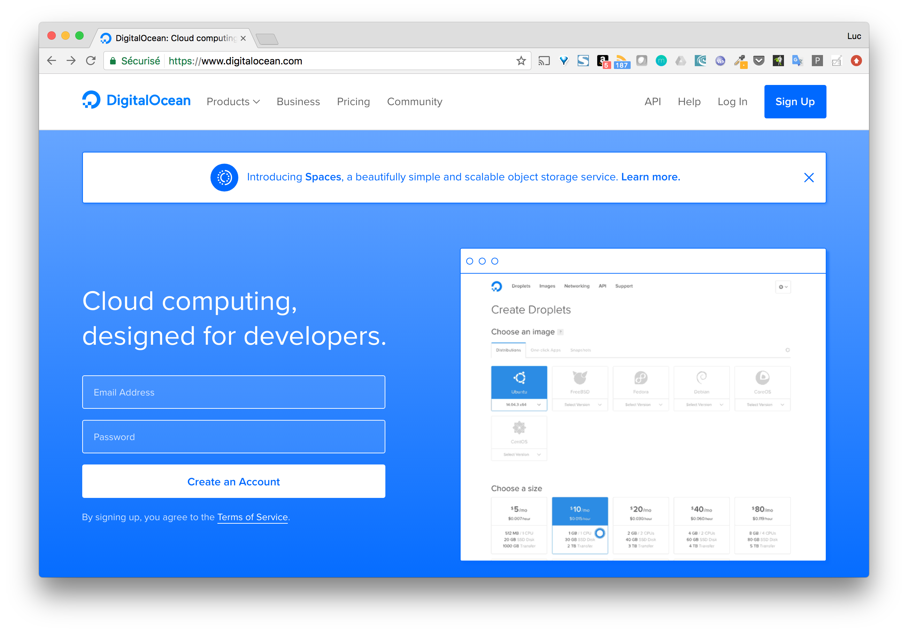
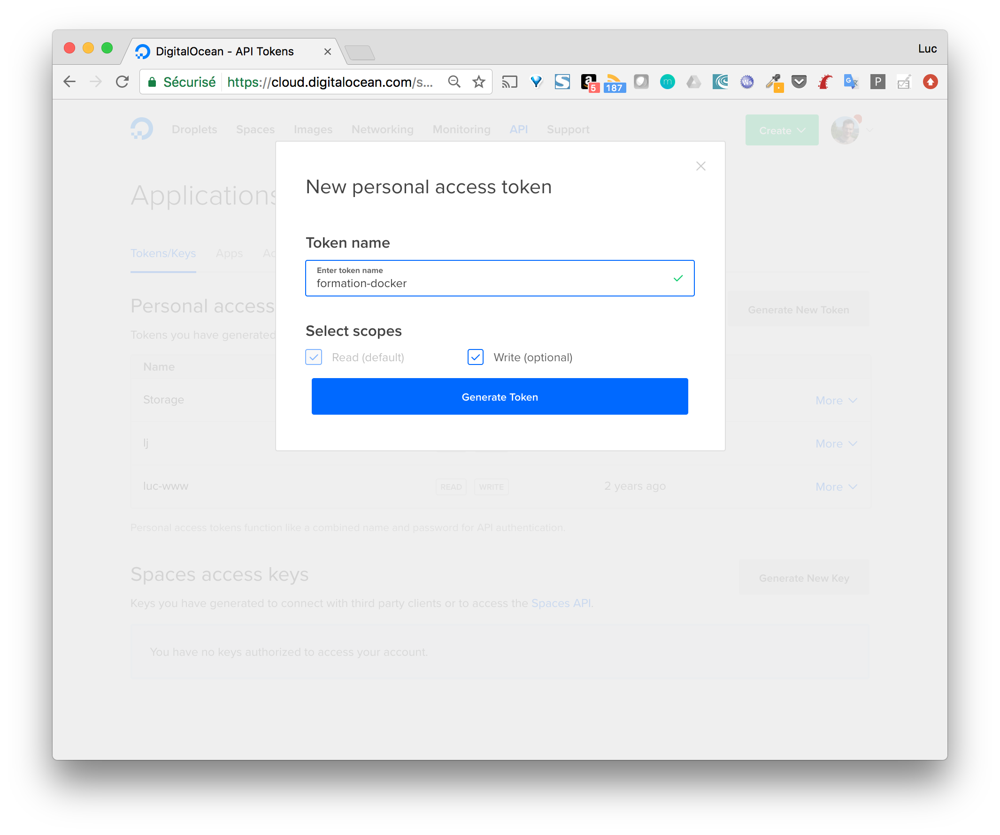
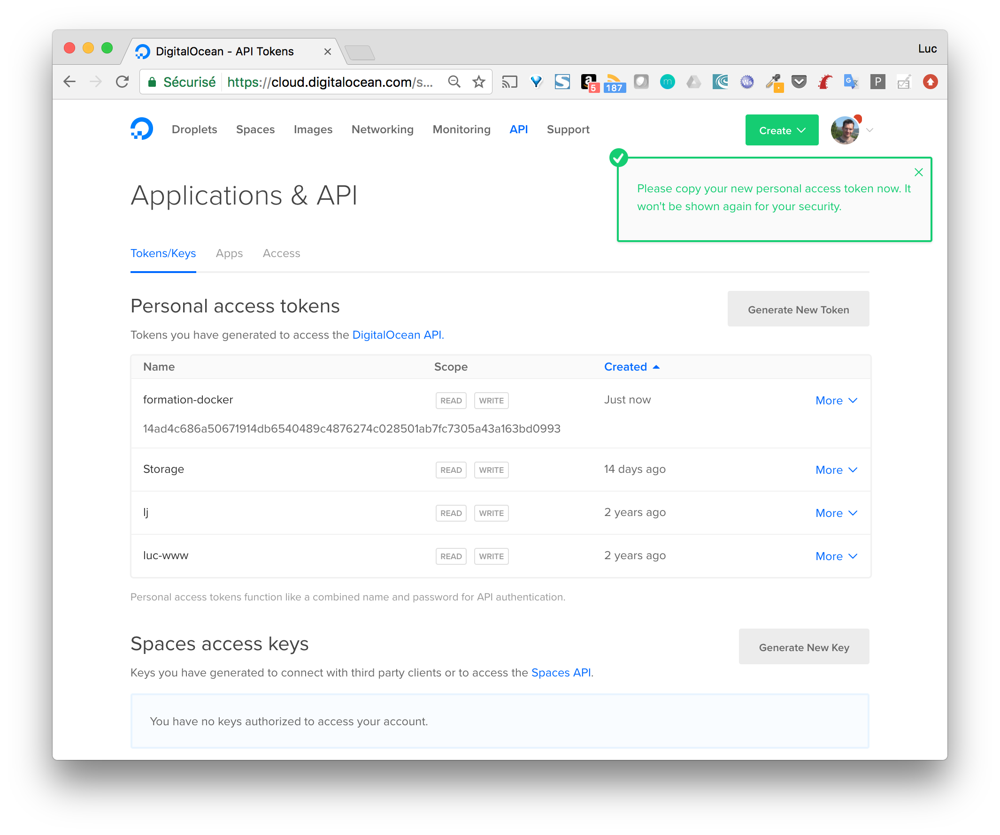
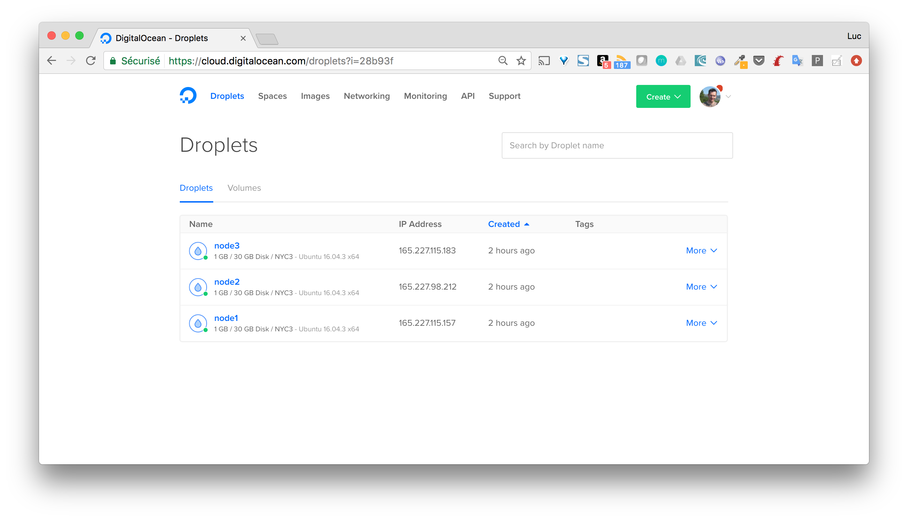

> Attention, dans cette mise en pratique, nous allons créer un cluster swarm sur DigitalOcean, un cloud provider très connu et simple à utiliser. Cependant, comme pour l'ensemble des cloud providers (Google Compute Engine, Amazon AWS, Packet, Rackspace, ...) l'instantiation de VMs est payante (très peu cher pour un test de quelques minutes cependant) et nécessite d'avoir un compte utilisateur. Si vous ne souhaitez pas réaliser la manipulation, n'hésitez pas à lire cet exemple sans l'appliquer.

## 1. Creation d'un compte sur DigitalOcean

Rendez-vous sur [DigitalOcean](https://digitalocean.com) et cliquez sur Signup en haut à droite.



## 2. Provisionnez votre compte

Une fois votre compte créé, il vous faudra le provisionner, seulement quelques euros suffiront à pouvoir jouer avec un cluster swarm.

## 3. Créez 3 machines virtuelles

Vous avez 2 options pour cela:

* créer un token pour l'API et utiliser Docker Machine (comme nous l'on fait précédemment)





* utiliser l'interface pour créer les VMs et ensuite installer Docker sur chaque machine (manuellement ou avec un outils de configuration management comme Ansible)

Nous utiliserons la première méthode car elle est beaucoup plus simple / pratique.

Lancez les commandes suivantes pour créer 3 machines, node1, node2 et node3.

```
$ docker-machine create --driver digitalocean --digitalocean-access-token $TOKEN --digitalocean-size=1gb node1
$ docker-machine create --driver digitalocean --digitalocean-access-token $TOKEN --digitalocean-size=1gb node2
$ docker-machine create --driver digitalocean --digitalocean-access-token $TOKEN --digitalocean-size=1gb node3
```

> Nous spécifions une taille de 1gb via l'option --digitalocean-size afin d'avoir des VMs plus "petites" (et 2 fois moins chères) que celles par défaut. Par défaut, une distribution Ubuntu 16.04 sera installée sur chaque machine virtuelle.

Une fois les 3 machines créées, assurez vous qu'elles sont bien listées par Docker Machine.

```
$ docker-machine ls
NAME    ACTIVE   DRIVER         STATE     URL                          SWARM   DOCKER        ERRORS
node1   -        digitalocean   Running   tcp://165.227.115.157:2376           v17.10.0-ce
node2   -        digitalocean   Running   tcp://165.227.98.212:2376            v17.10.0-ce
node3   -        digitalocean   Running   tcp://165.227.115.183:2376           v17.10.0-ce
```

Les machines que nous venons de créer sont aussi visibles depuis l'interface web de DigitalOcean



## 4. Initialisez le swarm sur le node1

Utilisez la commande suivante afin de lancer un shell ssh sur le node1

```
$ docker-machine ssh node1
```

Initialisez ensuite alors le swarm

```
root@node1:~# docker swarm init
Error response from daemon: could not choose an IP address to advertise since this system has multiple addresses on interface eth0 (165.227.115.157 and 10.17.0.5) - specify one with --advertise-addr
```

Le message d'erreur obtenu est intéressant, il demande de spécifier l'adresse IP du node1 que les autres machines du Swarm devront utiliser pour le contacter. Comme node1, node2 et node3 ne sont pas sur un réseau privé, chacune sera accessible via son IP publique.

Relancez l'initialisation du swarm en spécifiant l'adresse publique (celle qui n'est pas en 10.x.x.x) avec l'option --advertise-addr 

```
root@node1:~# docker swarm init --advertise-addr 165.227.115.157
Swarm initialized: current node (0dfpxa09fny4qvbimx1googa4) is now a manager.

To add a worker to this swarm, run the following command:

    docker swarm join --token SWMTKN-1-5gq3vzwpqig6r5o1zf1czlh1js7uwp1qgct4jtagi6ucw6zh1t-3pdk4qvwhgy8xdufofbco76t2 165.227.115.157:2377

To add a manager to this swarm, run 'docker swarm join-token manager' and follow the instructions.
```

Cette fois-ci le swarm est bien initialisé, et nous obtenons la commande à lancer depuis d'autres machines afin de les ajouter en tant que worker. Le token que vous obtiendrez sera différents de celui ci-dessus, nous appelerons celui-ci TOKEN_WORKER dans la suite. 

> Si nous voulons ajouter d'autres manager, il est nécessaire de récupérer le token dédié à l'ajout de manager avec la commande docker swarm join-token manager 

Listez les membres du swarm avec la commande suivante.

```
root@node1:~# docker node ls
ID                            HOSTNAME            STATUS              AVAILABILITY        MANAGER STATUS
0dfpxa09fny4qvbimx1googa4 *   node1               Ready               Active              Leader
```

> Au lieu de faire un ssh sur node1 pour initialiser le swarm, nous aurions pu utiliser les fonctionnalités de Docker Machine et connecter le client local avec le Docker daemon tournant sur le node1. Les 2 approches conduisent au même résultat.

## 5. Ajout de workers

Lancez les commandes suivantes afin ajouter node2 et node3 comme worker à notre swarm.

```
$ docker-machine ssh node2

root@node2:~# docker swarm join --token TOKEN_WORKER 165.227.115.157:2377
This node joined a swarm as a worker.
```

```
$ docker-machine ssh node3

root@node3:~# docker swarm join --token TOKEN_WORKER 165.227.115.157:2377
This node joined a swarm as a worker.
```

> Au lieu de faire un ssh sur node2 et node3, nous aurions pu utiliser les fonctionnalités de Docker Machine et connecter le client local avec le Docker daemon tournant sur chacune de ces machines à tour de rôle.

Listez une nouvelle fois, depuis node1, les membres du cluster.

```
root@node1:~# docker node ls
ID                            HOSTNAME            STATUS              AVAILABILITY        MANAGER STATUS
0dfpxa09fny4qvbimx1googa4 *   node1               Ready               Active              Leader
x5n4jac8cdmolzgkx0msq46wo     node2               Ready               Active
xy28751sefh9z1vpp4d69w4f1     node3               Ready               Active
```

## 6. Considérations pour la production

### 6.1. Le nombre de managers

Nous avons constitué un cluster comportant 3 machines dont une seule à le rôle de manager. La manager étant responsable de la gestion de l'état du cluster, aucune opération de contrôle du cluster (control plane) ne pourra être effectuée si le manager tombe. Dans cette optique, il est intéressant de passer le nombre de manager à 3 afin d'avoir une plus grande tolérance aux pannes. 

Note: il est conseillé d'avoir un nombre impair de manager avec un minimum de 3. Si l'on a un nombre impair de manager, ajouter un manager supplémentaire de changera pas la tolérance aux pannes.

Lancez les commandes suivantes afin de promouvoir node2 et node3 en tant que manager.

```
root@node1:~# docker node promote node2
Node node2 promoted to a manager in the swarm.

root@node1:~# docker node promote node3
Node node3 promoted to a manager in the swarm.

root@node1:~# docker node ls
ID                            HOSTNAME            STATUS              AVAILABILITY        MANAGER STATUS
0dfpxa09fny4qvbimx1googa4 *   node1               Ready               Active              Leader
x5n4jac8cdmolzgkx0msq46wo     node2               Ready               Active              Reachable
xy28751sefh9z1vpp4d69w4f1     node3               Ready               Active              Reachable
```

> Pour un cluster de taille plus conséquente et faisant tourner de nombreuses applications, il sera généralement conseillé de n'utiliser les managers que pour la gestion du cluster. Il seront en mode drain de façon à ce qu'aucune tâche (=container) ne leur soit assignée.

### 6.2. Ouverture des ports

Dans la configuration actuelle, nous n'avons pas précisé de règles d'ouverture de ports, tous les ports sont donc ouverts sur chaque machine. Pour un swarm, seuls les ports suivants devraient être ouverts:
* port TCP 2376: permet au client local de communiquer de façon sécurisée avec le daemon tournant sur une machine du swarm
* port TCP 2377: permet la communication entre les managers du swarm (port seulement ouvert sur les managers)
* port UDP 4789: permet la communication entre les containers sur un réseau overlay
* port TCP et UDP 7946: permet la communication entre les machines du swarm

> Il est également pratique (voire nécessaire) d'ouvrir le port 22 pour établir une connexion ssh sur chaque machine du swarm

Afin de sécuriser le swarm que nous avons créé, nous allons ouvrir l'ensemble de ces ports avec UFW (Uncomplicated Firewall) installé par défaut sur Ubuntu 16.04. Les commandes suivantes permettent d'ouvrir ces ports sur le node1.

```
root@node1:~# ufw allow 22/tcp
root@node1:~# ufw allow 2376/tcp
root@node1:~# ufw allow 2377/tcp
root@node1:~# ufw allow 7946/tcp
root@node1:~# ufw allow 7946/udp
root@node1:~# ufw allow 4789/udp
```

Il faut ensuite reloader la configuration et activer ufw avec les commandes suivantes:

```
root@node1:~# ufw reload
root@node1:~# ufw enable
```

Verifiez que seuls les ports spécifiés sont ouverts

```
root@node1:~# ufw status
Status: active
To                         Action      From
--                         ------      ----
22/tcp                     ALLOW       Anywhere
2376/tcp                   ALLOW       Anywhere
2377/tcp                   ALLOW       Anywhere
7946/tcp                   ALLOW       Anywhere
7946/udp                   ALLOW       Anywhere
4789/udp                   ALLOW       Anywhere
22/tcp (v6)                ALLOW       Anywhere (v6)
2376/tcp (v6)              ALLOW       Anywhere (v6)
2377/tcp (v6)              ALLOW       Anywhere (v6)
7946/tcp (v6)              ALLOW       Anywhere (v6)
7946/udp (v6)              ALLOW       Anywhere (v6)
4789/udp (v6)              ALLOW       Anywhere (v6)
```

Cette opération est à renouveler sur node2 et node3.

> Si nous déployons des services qui publient des ports, le daemon Docker ouvrira ces ports dans iptables et ceux-ci ne seront pas visibles via ufw. Nous reviendrons sur cela par la suite.
