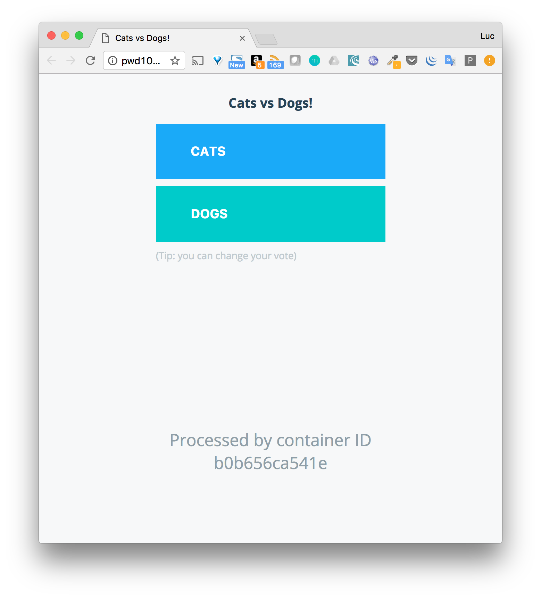
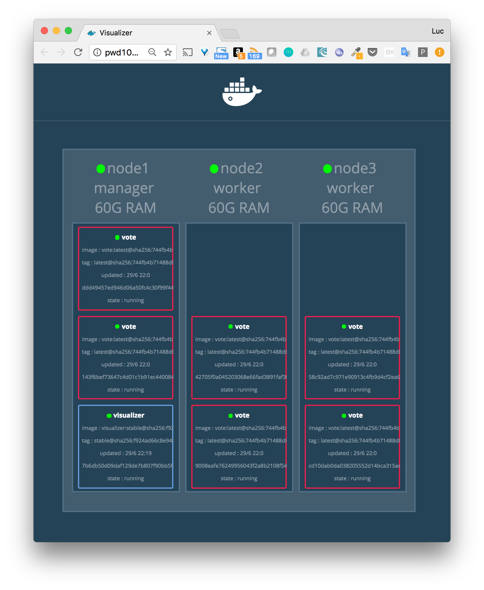
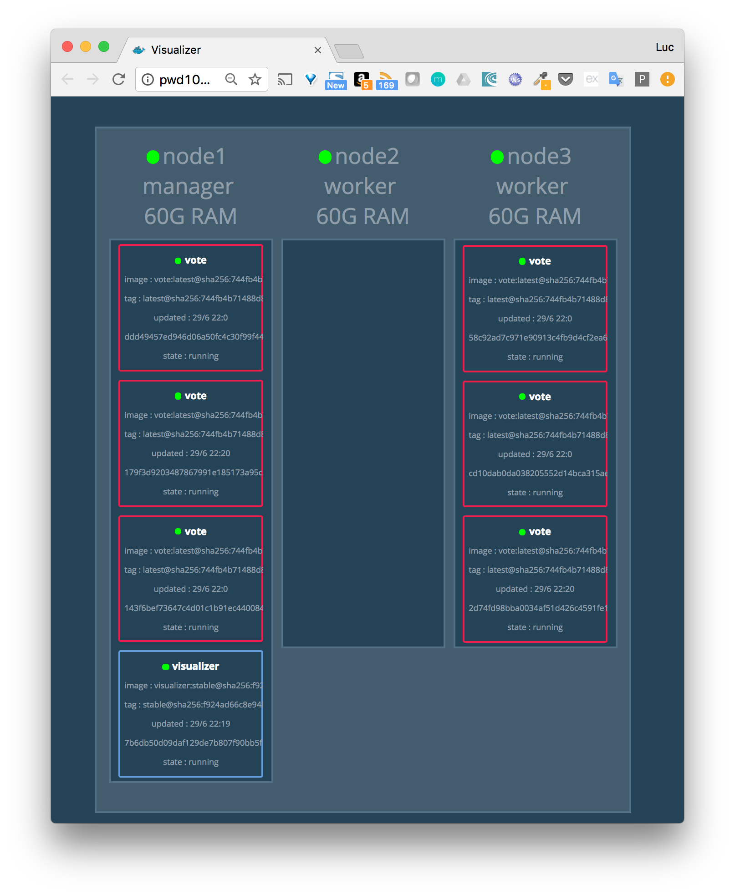
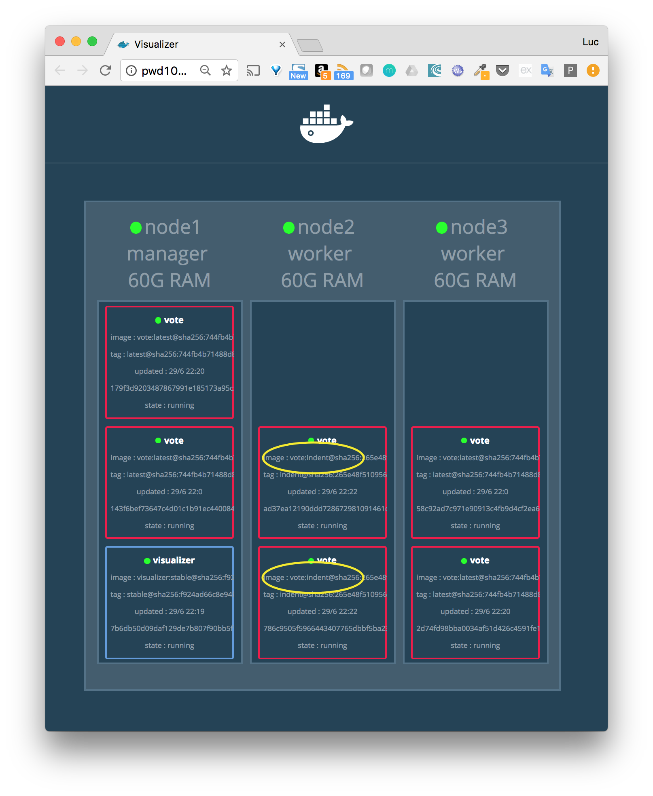

Dans cette partie, nous allons créer un service simple, le déployer et le scaler (c'est à dire augmenter le nombre de containers instanciés pour celui-ci).
Nous changerons également la disponibilité d’un node pour voir l’impact sur les tâches en cours.

> Nous repartons d'un swarm mis en place précédemment, composé de 3 hôtes Docker créés avec Docker Machine et nommés node1, node2 et node3.
> 
> ```
> $ docker-machine ls
> NAME    ACTIVE   DRIVER       STATE     URL                         SWARM   DOCKER        ERRORS
> node1   -        virtualbox   Running   tcp://192.168.99.100:2376           v17.10.0-ce
> node2   -        virtualbox   Running   tcp://192.168.99.101:2376           v17.10.0-ce
> node3   -        virtualbox   Running   tcp://192.168.99.102:2376           v17.10.0-ce
> ```
>

## Création d’un service

La commande suivante permet de définir un service:
* basé sur l’image instavote/vote:latest
* nommé vote
* dont le port 80 est publié sur le port 8080 de chaque hôte du cluster
* ayant 6 réplicas

Note: le nombre de réplicas correspond au nombre de tâches qui seront instanciées pour ce service. Chaque tâche lancera un container basée sur l’image définie dans le service.

```
$ docker service create \
    --name vote \
    --publish 8080:80 \
    --replicas 6 \
    instavote/vote
```

Après quelques secondes, le temps que l’image instavote/vote:latest soit téléchargée sur chaque node, les 6 tâches du services sont lancées. La commande suivante liste les tâches du service vote. Nous pouvons voir que 2 tâches ont été lancées sur chaque node.

```
$ docker service ps vote
ID            NAME    IMAGE                   NODE   DESIRED STATE  CURRENT STATE          ERROR PORTS
xnon20jonsfd  vote.1  instavote/vote:latest   node2  Running        Running 13 minutes ago
rganh2g8y8b7  vote.2  instavote/vote:latest   node3  Running        Running 13 minutes ago             
on8oog1833yq  vote.3  instavote/vote:latest   node1  Running        Running 13 minutes ago             
hmp2wtvojxro  vote.4  instavote/vote:latest   node2  Running        Running 13 minutes ago             
vdizjy291q4t  vote.5  instavote/vote:latest   node3  Running        Running 13 minutes ago             
mjpn0ybsg6pj  vote.6  instavote/vote:latest   node1  Running        Running 13 minutes ago 
```

Le service publie le port 80 sur le port 8080 du swarm via le mécanisme de routing mesh. Cela signifie que le service sera accessible depuis le port 8080 de chaque node du cluster. Nous pouvons vérifier le routing mesh en envoyant une requête sur le port 8080 de node1, node2 ou node3. Quelque soit le node sur lequel la requête est envoyée, le résultat est le même: l’interface permettant la selection entre cats et dogs.



> Seule la partie front-end est disponible sur cet exemple, il n’y a pas le backend permettant de prendre en compte la sélection.

Les requêtes envoyées sur le port 8080 d’un node du Swarm sont traitées selon un algorithme de round-robin entre les différents containers intanciés pour le service. Cela signifie que chacun des containers recevra une requète à tour de rôle.

Nous pouvons l’observer en lançant plusieurs requêtes à la suite et observer l’identifiant ID du container depuis l’interface web 

## Ajout du service de visualisation

La commande suivante définie un service qui servira à la visualisation des containers sur le cluster.

```
docker service create \
    --name visualizer \
    --mount type=bind,source=/var/run/docker.sock,destination=/var/run/docker.sock \
    --constraint 'node.role == manager' \
    --publish "8000:8080" dockersamples/visualizer:stable
```

La définition de ce service contient les informations suivantes:
* le nom du service: visualizer
* bind-mount de la socket du daemon docker (afin de permettre au container du visualizer de dialoguer avec le daemon Docker sur lequel il tourne)
* specification d’une contrainte de déploiement pour que le replica du service tourne sur le node qui a le rôle manager
* publication du port 8080 du container sur le port 8000 sur chaque hôte du Swarm
* Nous pouvons alors voir la répartition des containers sur les nodes via l’interface du visualiseur

L’interface donne le même résultat que lorsque l’on liste les service en ligne de commande, mais c’est une façon assez ludique de visualiser les containers.



## Passage du node2 en drain

Un node est dans l’un des états suivants:
* active, il peut recevoir des nouvelles tâches
* pause, il ne peut pas recevoir de nouvelles tâches mais les tâches en cours restent inchangées
* drain, il ne peut plus recevoir de nouvelles tâches et les tâches en cours sont re-schédulées sur d’autres nodes

La commande suivante change l’availability du node2 et le met dans l’état drain.

```
$ docker node update --availability drain node2    
```

Regardons comment la répartition des tâches précédentes a été modifiée.



Nous pouvons voir qu’il n’y a plus de tâche sur le node2. Elles ont été stoppées et reschédulées sur les autres nodes.

La commande suivante change l’availability du node2 en le repositionnant dans l’état active. Les tâches existantes sur node1 et node3 restent inchangées mais de nouvelles tâches peuvent de nouveau être schédulées sur node2.

```
$ docker node update --availability active node2
```

## Rolling upgrade

Nous allons à présent modifier paramêtres du service vote de façon à définir un rolling upgrade qui mettra les tâches à jour 2 par 2 toutes les 15 secondes. Par défaut, les tâches sont mises à jour l’une après l’autre.

Pour faire cela, nous définissons les paramêtres suivants:
* --update-parallelism que nous fixons à 2
* --update-delay que nous fixons à 15s

```
$ docker service update \
    --update-parallelism 2 \
    --update-delay 15s \
    vote
```

Une fois ces paramêtres modifiés, nous mettons à jour l’image utilisée pour le service. La nouvelle version utilisée aura le tag indent au lieu de latest.

```
$ docker service update --image instavote/vote:indent vote
```

Si nous observons l’interface du visualiseur nous pouvons observer que la mise à jour se fait de façon graduelle.



Après quelques secondes, tous les containers de l’application sont basés sur l’image ayant le tag **intend**.


## En résumé

Nous avons vu dans cette mise en pratique plusieurs commandes de gestion du swarm, nous avons également crée un service que nous avons mis à jour en définissant des paramêtres de rolling upgrade.
