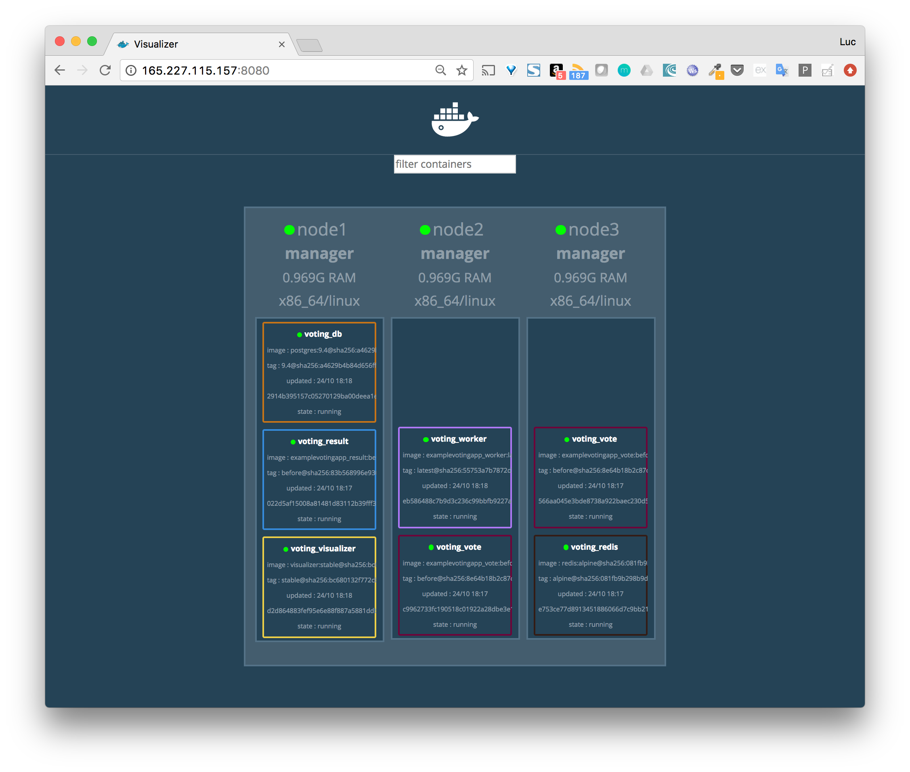
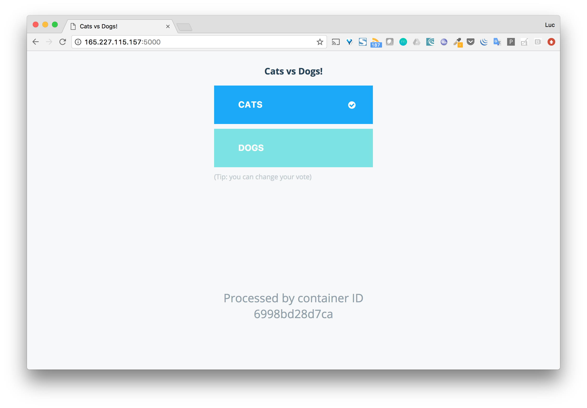
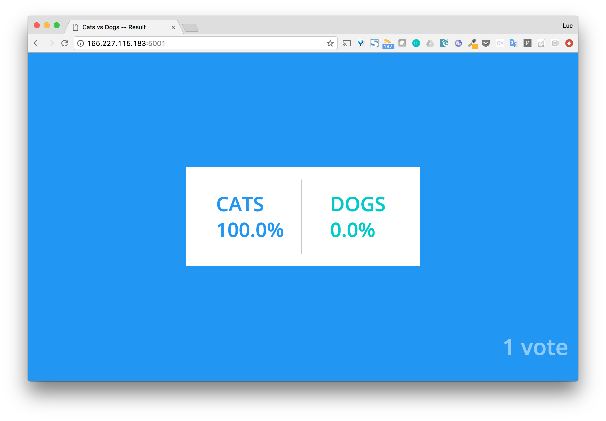
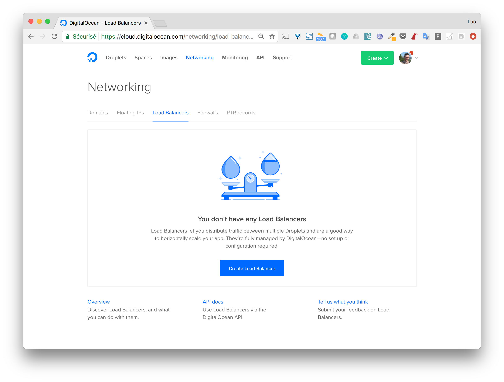
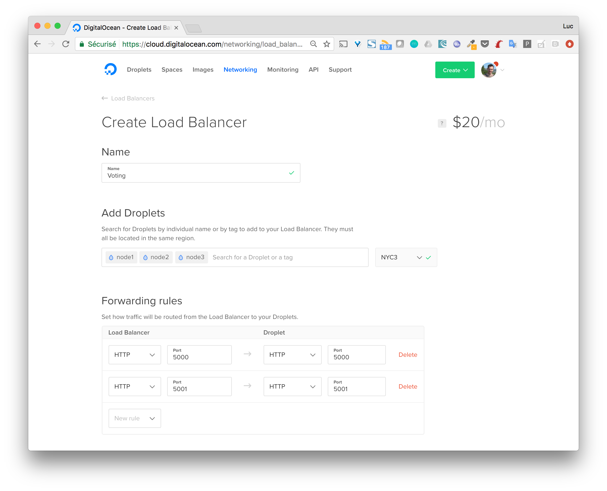
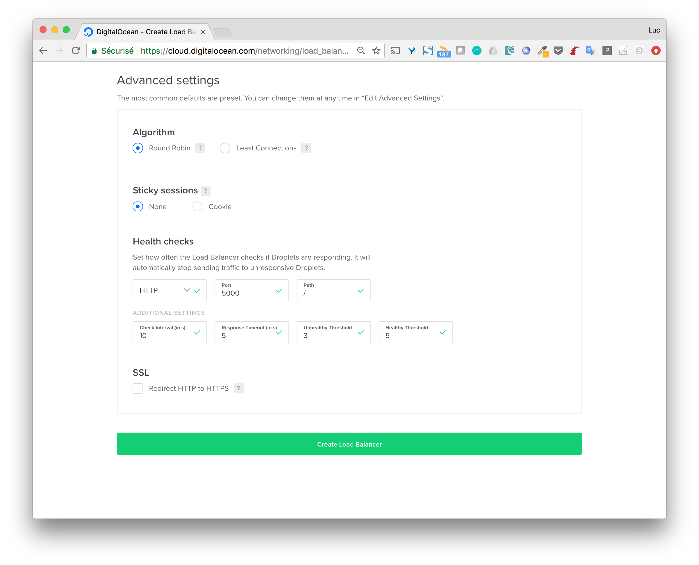
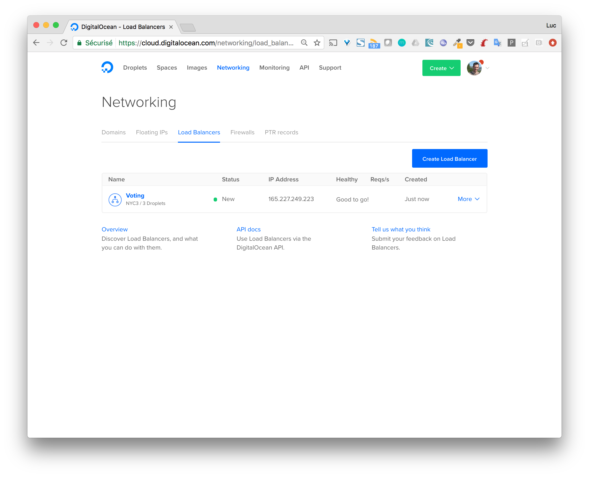
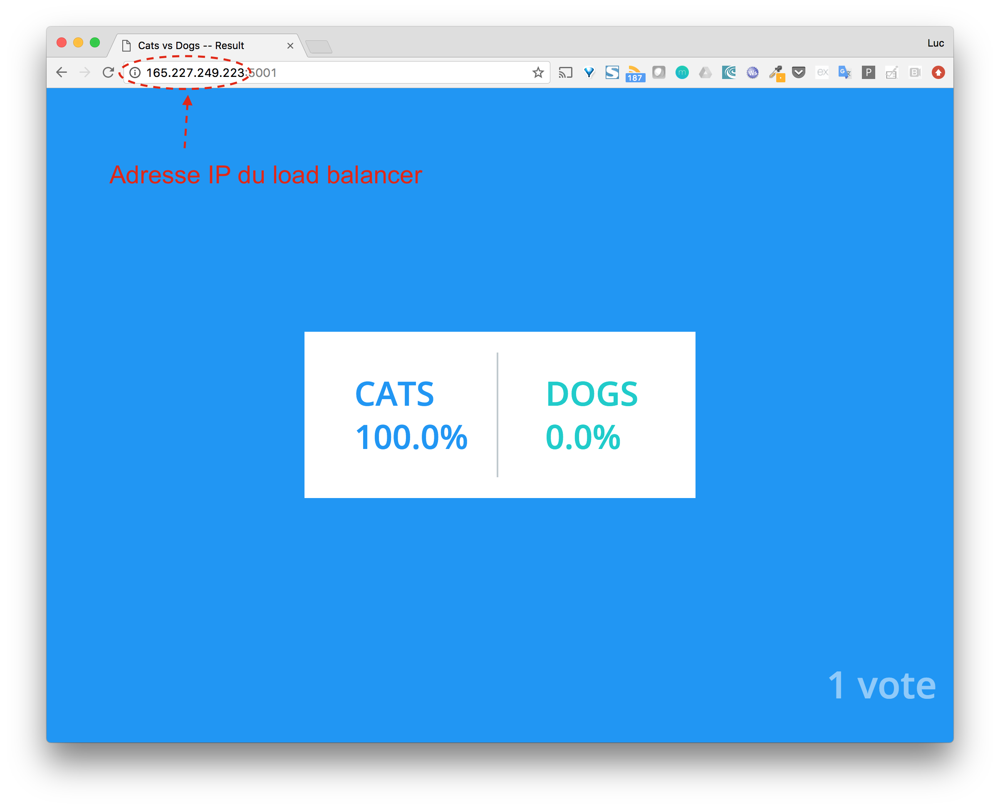

Dans cette mise en pratique, nous allons utiliser le swarm que nous avons créé précédemment sur DigitalOcean.

## 1. SSH sur node1

node1 ayant été créé avec docker-machine, nous pouvons faire un ssh avec la commande suivante

```
$ docker-machine ssh node1
```

> Nous nous positionnons sur le node1 mais étant donné que les 3 machines du swarm ont ici le rôle de manager, nous pourrions nous positionner aussi bien lancer les commandes suivantes depuis node2 ou node3

## 2. Déploiement de la Voting App

Durant ce cours nous avons parlé plusieurs fois de cette application très utilisée pour les démos et présentations. Nous allons l'utiliser à nouveau et la déployer sur notre cluster swarm.

Récupérez le repository avec la commande suivante:

```
root@node1:~# git clone https://github.com/dockersamples/example-voting-app.git
Cloning into 'example-voting-app'...
remote: Counting objects: 377, done.
remote: Total 377 (delta 0), reused 0 (delta 0), pack-reused 377
Receiving objects: 100% (377/377), 204.54 KiB | 0 bytes/s, done.
Resolving deltas: 100% (133/133), done.
Checking connectivity... done.

root@node1:~# cd example-voting-app
```


Comme nous le voyons dans le fichier docker-stack.yml (ci-dessous), 6 services sont définis. Chacun d'entre eux à un seul réplica (= un seul container) à l'exception du service vote qui en a 2. Au total nous aurons donc 7 containers.

```
version: "3"
services:

  redis:
    image: redis:alpine
    ports:
      - "6379"
    networks:
      - frontend
    deploy:
      replicas: 1
      update_config:
        parallelism: 2
        delay: 10s
      restart_policy:
        condition: on-failure
  db:
    image: postgres:9.4
    volumes:
      - db-data:/var/lib/postgresql/data
    networks:
      - backend
    deploy:
      placement:
        constraints: [node.role == manager]
vote:
    image: dockersamples/examplevotingapp_vote:before
    ports:
      - 5000:80
    networks:
      - frontend
    depends_on:
      - redis
    deploy:
      replicas: 2
      update_config:
        parallelism: 2
      restart_policy:
        condition: on-failure
  result:
    image: dockersamples/examplevotingapp_result:before
    ports:
      - 5001:80
    networks:
      - backend
    depends_on:
      - db
    deploy:
      replicas: 1
      update_config:
        parallelism: 2
        delay: 10s
      restart_policy:
        condition: on-failure

  worker:
    image: dockersamples/examplevotingapp_worker
    networks:
      - frontend
      - backend
    deploy:
      mode: replicated
      replicas: 1
      labels: [APP=VOTING]
      restart_policy:
        condition: on-failure
        delay: 10s
        max_attempts: 3
        window: 120s
      placement:
        constraints: [node.role == manager]

  visualizer:
    image: dockersamples/visualizer:stable
    ports:
      - "8080:8080"
    stop_grace_period: 1m30s
    volumes:
      - "/var/run/docker.sock:/var/run/docker.sock"
    deploy:
      placement:
        constraints: [node.role == manager]

networks:
  frontend:
  backend:

volumes:
  db-data:
```

Lancez l'application en tant que stack à partir de ce fichier.

```
root@node1:~# docker stack deploy -c docker-stack.yml voting
Creating network voting_frontend
Creating network voting_backend
Creating network voting_default
Creating service voting_vote
Creating service voting_result
Creating service voting_worker
Creating service voting_visualizer
```

## 3. Distribution des services

L'application Voting App fournit une interface de visualisation. Celle-ci est disponible sur le port 8080 de chaque machine du swarm (grace au routing mesh). Comme nous pouvons le voir ci-dessous, l'interface montre la distribution des containers sur le swarm.



Nous avons bien ici les 7 containers de notre application. Nous pouvons voter et visualiser les résultats depuis les interfaces dédiées. La première disponible sur le port 5000 de chaque machine du swarm (grace au routing mesh), la seconde sur le port  5001.





## 4. Ajout d'un load balancer

Afin d'accéder à l'application, dont les composants sont distribués sur les machines de notre swarm, nous utiliserons un load balancer comme point d'entrée. Celui-ci permettra à la fois de:
* répartir la charge entre les différentes machines
* réduire l'indisponibilité de service au cas ou une machine tombe en panne

La plupart des cloud providers propose des solutions de load balancers. Dans l'exemple qui suit, nous allons utiliser la solution de DigitalOcean, cela permettra de simplifier la mise en place du lien avec les machines de notre swarm (elles même sur DigitalOcean).



Les 2 copies d'écran suivantes définissent les options du load balancer:
* les règles de redirection: le traffic arrivant sur le port 5000 du load balancer sera redirigé sur le port 5000 de l'une des machines du warm. De la même façon, le traffic arrivant sur le port 5001 du load balancer sera redirigé sur le port 5001 de l'une des machines
* la spécification de l'algorithme de redirection: "Round Robin". Cet algorithme permet de rediriger le traffic de façon séquentielle sur chaque machine
* le Health Check: permet de vérifier l'état de santé de l'application tournant sur la machine et de la supprimer du pool de redirection si nécessaire





Une fois créé, nous obtenons l'adresse IP de notre load balancer



Nous pouvons l'utiliser pour accéder à notre application. Si dessous l'exemple qui permet d'accéder à l'interface de visualisation des résultats.



## 5. Parmi les améliorations possibles

Notre application, bien que déployée sur un swarm et accessible via un load balancer, nécessiterait d'autres améliorations, comme par exemple:
* l'ajout d'une terminaison TLS, afin d'assurer la sécurité des échanges (ok, ce n'est pas forcément nécessaire ici car nous n'envoyons pas de données sensibles comme des identifiants, mots de passe, ...)
* un nom de domaine associé au load balancer (très facilement faisable depuis l'interface de DigitalOcean)
* nous pourrions également mettre en place une autre entrée dans le load balancer afin de répartir les requêtes de gestion du swarm, c'est à dire les commandes docker s'adressant à l'un des daemons sur le port 2376, sur l'ensemble des machines du cluster
