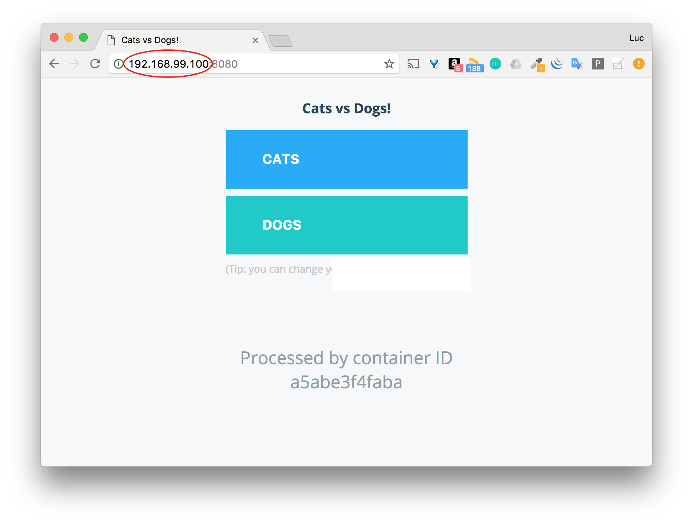
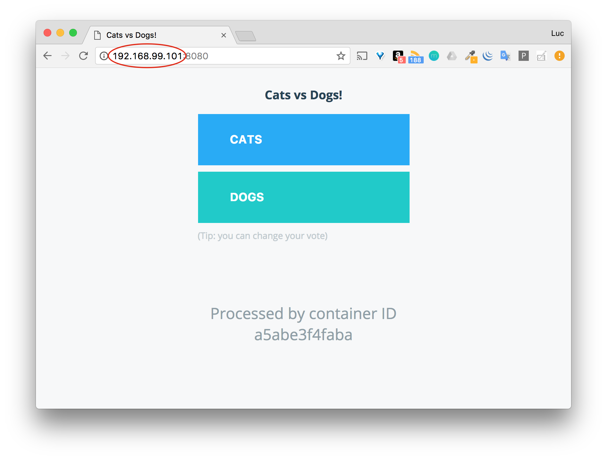

# Routing Mesh

Dans ce lab nous allons illustrer le mécanisme de Routing Mesh utilisé dans un swarm.

## Présentation

Le mode Swarm de Docker facilite la publication des ports d’un service afin de les rendre accessible depuis l’extérieur du Swarm. Tous les nodes du Swarm participent à un réseau ingress effectuant le routage en entrée. Celui-ci permet à chaque node du Swarm d’accepter des connexions sur les ports publiés d’un service, même si aucune tâche de ce service ne tourne sur le node en question. Le routing mesh route alors les requêtes vers un node sur lequel tourne un container du service.

Le schéma suivant illustre ce mécanisme.


## Création d’un swarm

Une solution simple est d'utiliser *Docker Machine* pour créer 2 hôtes Docker. Nous initialiserons le swarm sur l'un des 2 hôtes et ajouterons le second.

Dans cet exemple, j'utilise le driver *virtualbox* afin de créer les machines virtuelles en local.

### Création des VMs

```
$ docker-machine create --driver virtualbox node01
$ docker-machine create --driver virtualbox node02
```

> Vous pouvez utiliser un autre driver si vous le souhaitez afin de créer les VMs sur un autre hyperviseur (Hyper-V) ou sur un cloud provider (AWS, DigitalOcean, Microsoft Azure, ...)

Sur ma machine de développement, les VMs sont créées avec les IPs suivantes, les votres pourront être différentes.

```
$ docker-machine ls
NAME     ACTIVE   DRIVER       STATE     URL                         SWARM   DOCKER        ERRORS
node01   -        virtualbox   Running   tcp://192.168.99.100:2376           v17.10.0-ce
node02   -        virtualbox   Running   tcp://192.168.99.101:2376           v17.10.0-ce
```

### Initialisation du swarm

Depuis node01, lancez la commande suivante en utilisant l'adresse que vous avez obtenue pour ce node.

```
$ docker swarm init --advertise-addr 192.168.99.100
Swarm initialized: current node (311ep1n2wcgrje263l45sjrix) is now a manager.

To add a worker to this swarm, run the following command:

    docker swarm join --token SWMTKN-1-081l3uznies41wgvgtjnnyc1c2tczcdnopqiyoo1z249xq043b-3haunf75clx1dfabv5gvgt9fv 192.168.99.100:2377

To add a manager to this swarm, run 'docker swarm join-token manager' and follow the instructions.
```

Depuis *node02* lancez la commande de *join* telle qu'elle est précisée par la commande précédente.

```
$ docker swarm join --token SWMTKN-1-081l3uznies41wgvgtjnnyc1c2tczcdnopqiyoo1z249xq043b-3haunf75clx1dfabv5gvgt9fv 192.168.99.100:2377
This node joined a swarm as a worker.
```

Vous pouvez alors lister les nodes de votre swarm avec la commande suivante:

```
$ docker node ls
ID                            HOSTNAME            STATUS              AVAILABILITY        MANAGER STATUS
311ep1n2wcgrje263l45sjrix *   node01              Ready               Active              Leader
t0u519i3rusd7442d8nfypf4e     node02              Ready               Active
```

## Lancement d’un service

Depuis *node01*, le manager de notre swarm, nous lançons à présent un service avec les caractéristiques suivantes:
* basé sur l’image instavote/vote
* nommé vote
* mode répliqué avec un seul réplica (configuration par défaut)
* publication du port 80 sur le port 8080 sur le Swarm

```
$ docker service create --name vote --publish 8080:80 instavote/vote
```

Après quelques secondes, le temps que l’image soit téléchargée depuis le Docker Hub, nous pouvons voir que le service est disponible.

```
docker service ls
ID             NAME  MODE        REPLICAS  IMAGE                  PORTS
yqj26nfcr57q   vote  replicated  1/1       instavote/vote:latest  *:8080->80/tcp
```

La commande suivante nous permet de voir que l’unique tâche du service vote (un seul réplica ayant été défini) a été lancée sur le node1.

```
docker service ps vote
ID            NAME   IMAGE                  NODE  DESIRED STATE  CURRENT STATE          ERROR PORTS
4hkchcicdlzv  vote.1 instavote/vote:latest  node1 Running        Running 2 minutes ago
```

## Routing Mesh

Le Routing Mesh permet au service d’être accessible depuis le port 8080 de chaque node du Swarm, comme le montre les copies d'écran suivantes:





Depuis les 2 IPs, nous accédons à l’interface de vote qui permet de choisir entre cats et dogs.

## Quelques explications

Le routing mesh repose sur iptables (règles de firewall) et ipvs (load balancer au niveau 4).

### Rêgles de routage sur la machine hôte

Lors de la création du service, des règles de routage, relatives au port 8080, ont étés définies dans iptables sur chaque node.

Depuis le *node01*, nous examinons la table nat.

```
$ sudo iptables -nvL -t nat
```

Le traffic qui arrive sur le port 8080 du *node01* est redirigé sur l’IP 172.18.0.2, comme le montre la chaine de DOCKER-INGRESS.

```
...
Chain DOCKER-INGRESS (2 references)
 pkts bytes target     prot opt in     out     source               destination
    3   192 DNAT       tcp  --  *      *       0.0.0.0/0            0.0.0.0/0            tcp dpt:8080 to:172.18.0.2:8080
   40  2562 RETURN     all  --  *      *       0.0.0.0/0            0.0.0.0/0
...
```

### Namespace réseau

Depuis *node01*, nous pouvons lister les namespaces réseau existant.

```
sudo ls /var/run/docker/netns
1-rq1hlr8s03  216a926021c6  ingress_sbox
```

Dans cet exemple, le namespace *1-rq1hlr8s03* correspond au network ingress créé sur le Swarm. L’identifiant de ce réseau peut-être obtenu en listant les réseaux existants.

```
$ docker network ls
NETWORK ID          NAME                DRIVER              SCOPE
a4c05393dde5        bridge              bridge              local
eaf692c7fc58        docker_gwbridge     bridge              local
c928c52f756c        host                host                local
rq1hlr8s03yt        ingress             overlay             swarm
028a2fba4f45        none                null                local
```

Nous allons maintenant utiliser *nsenter* pour lancer un shell dans le namespace *ingress_sbox*.

> Nous utilisons ici un container pour installer *nsenter* car cet utilitaire n'est pas présent sur la distribution Core Linux qui est installée par Docker Machine. L'installation via l'image *jpetazzo/nsenter* est simple et nous évite une étape de compilation sur Core Linux.

```
$ docker run --rm -v /usr/local/bin:/target jpetazzo/nsenter
Installing nsenter to /target
Installing docker-enter to /target
Installing importenv to /target
```

Une fois *nsenter* installé, nous lançons un process *sh* dans le namespace *ingress_sbox*

```
$ nsenter --net=/var/run/docker/netns/ingress_sbox sh
```

Nous pouvons voir que l’une des interface réseau présente dans ce namespace à l’IP référencée dans la table nat de iptables (172.18.0.2 dans cet exemple).

```
1: lo: <LOOPBACK,UP,LOWER_UP> mtu 65536 qdisc noqueue state UNKNOWN group default qlen 1
    link/loopback 00:00:00:00:00:00 brd 00:00:00:00:00:00
    inet 127.0.0.1/8 scope host lo
       valid_lft forever preferred_lft forever
9: eth0@if10: <BROADCAST,MULTICAST,UP,LOWER_UP> mtu 1450 qdisc noqueue state UP group default
    link/ether 02:42:0a:ff:00:02 brd ff:ff:ff:ff:ff:ff
    inet 10.255.0.2/16 scope global eth0
       valid_lft forever preferred_lft forever
12: eth1@if13: <BROADCAST,MULTICAST,UP,LOWER_UP> mtu 1500 qdisc noqueue state UP group default
    link/ether 02:42:ac:12:00:02 brd ff:ff:ff:ff:ff:ff
    inet 172.18.0.2/16 scope global eth1
       valid_lft forever preferred_lft forever
```

Toujours depuis le shell en exécution dans le namespace ingress_sbox, nous regardons la table mangle de iptables.

```
$ iptables -nvL -t mangle
Chain PREROUTING (policy ACCEPT 41 packets, 7486 bytes)
 pkts bytes target     prot opt in     out     source               destination
   23  2383 MARK       tcp  --  *      *       0.0.0.0/0            0.0.0.0/0            tcp dpt:8080 MARK set 0x100

Chain INPUT (policy ACCEPT 23 packets, 2383 bytes)
 pkts bytes target     prot opt in     out     source               destination

Chain FORWARD (policy ACCEPT 18 packets, 5103 bytes)
 pkts bytes target     prot opt in     out     source               destination

Chain OUTPUT (policy ACCEPT 23 packets, 2383 bytes)
 pkts bytes target     prot opt in     out     source               destination
    0     0 MARK       all  --  *      *       0.0.0.0/0            10.255.0.4           MARK set 0x100

Chain POSTROUTING (policy ACCEPT 41 packets, 7486 bytes)
 pkts bytes target     prot opt in     out     source               destination
```

Les packets arrivant sur le port 8080 sont estampilés avec la valeur 0x100 (256 en décimal) dans la chaine PREROUTING et sont envoyés sur l’IP 10.255.0.4 dans le chaine OUTPUT. Cette adresse IP correspond à l’adresse IP virtuelle (VIP) du service vote comme le montre la commande d’inspection suivante:

```
docker service inspect -f "{{ .Endpoint.VirtualIPs }}" vote
[{rq1hlr8s03ytw7xo9yo5bzeov 10.255.0.4/16}]
```

### Load balancer L4

IPVS est une technologie présente dans le kernel Linux depuis plusieurs années et permet de faire du load-balancing au niveau 4.

> Nous n'installerons pas *ipvsadm* ici (processus un peu compliqué sur Core Linux) mais nous allons illustrer son utilisation.

Une fois *ipvsadm* installé, nous pouvons lister les tables ipvs avec la commande suivante.

```
$ ipvsadm -ln
IP Virtual Server version 1.2.1 (size=4096)
Prot LocalAddress:Port Scheduler Flags
  -> RemoteAddress:Port           Forward Weight ActiveConn InActConn
FWM  256 rr
  -> 10.255.0.5:0                 Masq    1      0          0
```

Nous pouvons voir que les paquets marqués avec 256 (0x100) sont formardés sur une IP particulière (*10.255.0.5:0* dans cet exemple). Il s’agit de l’adresse IP du seul container du service. Nous pouvons le vérifier en listant les tâches du service puis en inspectant le container depuis l’hôte sur lequel il tourne.

Nous n’avons qu’un seul container pour le service vote. La commande suivante met le service à jour en spécifiant 3 réplicas.

```
$ docker service update --replicas 3 vote
```

3 tâches sont alors créées sur le cluster, et pour chacune d’entre elles un container sera lancé.

Si nous listons une nouvelle fois les tables de ipvs, nous pouvons voir que le traffic sera load-balancé entre les 3 containers.

```
$ ipvsadm -ln
IP Virtual Server version 1.2.1 (size=4096)
Prot LocalAddress:Port Scheduler Flags
  -> RemoteAddress:Port           Forward Weight ActiveConn InActConn
FWM  256 rr
  -> 10.255.0.5:0                 Masq    1      0          0
  -> 10.255.0.6:0                 Masq    1      0          0
  -> 10.255.0.7:0                 Masq    1      0          0
```

## Résumé

Ce lab est une overview des technologies impliquées dans le routing mesh, notamment *iptabes* et *ipvs*. L’avantage de swarm est notamment de cacher une grande partie de cette complexité à l’utilisateur.

Le port publié par un service étant disponible sur chaque node, on mettra généralement un load-balancer en front-end du swarm de façon à repartir la charge et garantir la disponibilité de l'application si un node tombe.
