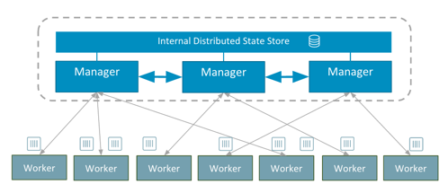

## Raft logs

Dans cette mise en pratique, nous allons démistifier les logs qui sont utilisés par l’algorithme Raft afin de gérer l’état du cluster.

Ces logs sont crées sur le Leader des managers et répliqués sur chaque manager.

## Swarm architecture



## Création d’un swarm

> si vous avez déjà créé un cluster swarm, vous pouvez passer directement

Une solution simple est d'utiliser *Docker Machine* pour créer 2 hôtes Docker. Nous initialiserons le swarm sur l'un des 2 hôtes et ajouterons le second.

Dans cet exemple, j'utilise le driver *virtualbox* afin de créer les machines virtuelles en local.

### Création des VMs

```
$ docker-machine create --driver virtualbox node01
$ docker-machine create --driver virtualbox node02
```

> Vous pouvez utiliser un autre driver si vous le souhaitez afin de créer les VMs sur un autre hyperviseur (Hyper-V) ou sur un cloud provider (AWS, DigitalOcean, Microsoft Azure, ...)

Sur ma machine de développement, les VMs sont créées avec les IPs suivantes, les votres pourront être différentes.

```
$ docker-machine ls
NAME     ACTIVE   DRIVER       STATE     URL                         SWARM   DOCKER        ERRORS
node01   -        virtualbox   Running   tcp://192.168.99.100:2376           v17.10.0-ce
node02   -        virtualbox   Running   tcp://192.168.99.101:2376           v17.10.0-ce
```

### Initialisation du swarm

Lorsque nous sommes sur un node qui n’est pas en mode Swarm, le répertoire swarm du dossier d’installation de Docker est vide.

```
$ ls /var/lib/docker/swarm
```

Depuis node01, lancez la commande suivante en utilisant l'adresse que vous avez obtenue pour ce node.

```
$ docker swarm init --advertise-addr 192.168.99.100
Swarm initialized: current node (311ep1n2wcgrje263l45sjrix) is now a manager.

To add a worker to this swarm, run the following command:

    docker swarm join --token SWMTKN-1-081l3uznies41wgvgtjnnyc1c2tczcdnopqiyoo1z249xq043b-3haunf75clx1dfabv5gvgt9fv 192.168.99.100:2377

To add a manager to this swarm, run 'docker swarm join-token manager' and follow the instructions.
```

Depuis *node02* lancez la commande de *join* telle qu'elle est précisée par la commande précédente.

```
$ docker swarm join --token SWMTKN-1-081l3uznies41wgvgtjnnyc1c2tczcdnopqiyoo1z249xq043b-3haunf75clx1dfabv5gvgt9fv 192.168.99.100:2377
This node joined a swarm as a worker.
```

Vous pouvez alors lister les nodes de votre swarm avec la commande suivante:

```
$ docker node ls
ID                            HOSTNAME            STATUS              AVAILABILITY        MANAGER STATUS
311ep1n2wcgrje263l45sjrix *   node01              Ready               Active              Leader
t0u519i3rusd7442d8nfypf4e     node02              Ready               Active
```

A partir du moment ou le daemon Docker est en mode Swarm (suite à la commande d’initialisation précédente), plusieurs éléments sont présents dans le répertoire swarm.

```
$ find /var/lib/docker/swarm
/var/lib/docker/swarm
/var/lib/docker/swarm/docker-state.json
/var/lib/docker/swarm/certificates
/var/lib/docker/swarm/certificates/swarm-root-ca.crt
/var/lib/docker/swarm/certificates/swarm-node.key
/var/lib/docker/swarm/certificates/swarm-node.crt
/var/lib/docker/swarm/worker
/var/lib/docker/swarm/worker/tasks.db
/var/lib/docker/swarm/state.json
/var/lib/docker/swarm/raft
/var/lib/docker/swarm/raft/snap-v3-encrypted
/var/lib/docker/swarm/raft/wal-v3-encrypted
/var/lib/docker/swarm/raft/wal-v3-encrypted/0.tmp
/var/lib/docker/swarm/raft/wal-v3-encrypted/0000000000000000-0000000000000000.wal
```

Les logs sont situés dans le répertoire raft, les clés d’encryption dans le répertoire certificates.

### Création d’un secret

La commande suivante permet de créer un secret nommé passwd et contenant une chaine de caractère.

```
$ echo 'A2e5bc21' | docker secret create passwd -
```

Si nous listons les secrets existants sur notre swarm, seul le secret précédemment créé apparait, son contenu n’est plus visible.

```
$ docker secret ls
ID                          NAME     CREATED        UPDATED
4mbzd3pt9jk9z2lqehm7e77bb   passwd   8 seconds ago  8 seconds ago
```

Nous verrons par la suite que ce secret est en clair dans les logs de Raft.

## A propos des logs de Raft

La version 1.13 de la plateforme Docker a introduit la gestion des secrets dans le contexte d’un swarm. Ce sont des information sensibles, par exemple des identifiants de connexion à des services tiers. Les secrets sont stockées en clair dans les logs utilisés par l’implémentation de l’algorithme Raft et c’est notamment pour cette raison que logs sont cryptés, afin d’assurer la confidentialité de ces informations.

Les secrets sont généralement créés par les Ops lors du lancement de l’application puis fournis au service qui en ont besoin. Ils seront alors accessibles, dans les containers du service, depuis un système de fichiers temporaire sous */run/secrets/NOM_DU_SECRET*.

## Décryptage des logs

Nous allons utiliser ici l’utilitaire swarm-rafttool, un binaire qui se trouve dans la librairie SwarmKit utilisée par Docker pour la gestion des clusters swarm.

### Swarm Rafttool

Afin d'éviter l'installation de cet utilitaire, nous le lançons directement depuis un container.

```
$ docker run --rm -ti -v /var/lib/docker/swarm/:/var/lib/docker/swarm:ro -v $(pwd):/tmp/ zaggash/docker-rafttool
```

Nous pouvons alors voir les différentes options possibles:

```
/ # swarm-rafttool
Tool to translate and decrypt the raft logs of a swarm manager

Usage:
 /root/go/bin/swarm-rafttool [command]

Available Commands:
  decrypt Decrypt a swarm manager’s raft logs to an optional directory
  dump-wal Display entries from the Raft log
  dump-snapshot Display entries from the latest Raft snapshot
  dump-object Display an object from the Raft snapshot/WAL

Flags:
  -h, --help help for /root/go/bin/swarm-rafttool
  -d, --state-dir string State directory (default “/var/lib/swarmd”)
  --unlock-key string Unlock key, if raft logs are encrypted

Use "/root/go/bin/swarm-rafttool [command] — help" for more information about a command.
```

Dans la suite, nous utiliserons la command dump-wal afin de décrypter et visualiser les entrées du fichier de logs.

### Décryptage

Afin de décrypter le fichier de log, nous créons un script shell qui va tout d’abord copier le fichier puis lancer le binaire swarm-rafttool sur cette copie. L’étape de copie est nécessaire car swarm-rafttool ne permet pas de décrypter les logs en cours d’usage.

Avec un petit coup de vi, copiez dans un fichier dump.sh (dans le container lancé précédemment) le contenu suivant:

```
d=$(date "+%Y%m%dT%H%M%S")
SWARM_DIR=/var/lib/docker/swarm
WORK_DIR=/tmp
DUMP_FILE=$WORK_DIR/dump-$d
STATE_DIR=$WORK_DIR/swarm-$d
cp -r $SWARM_DIR $STATE_DIR
$GOPATH/bin/swarm-rafttool dump-wal --state-dir $STATE_DIR > $DUMP_FILE
echo $DUMP_FILE
```

Nous pouvons alors lancer ce script et observer le contenu des logs.

```
/ # chmod +x ./dump.sh
/ # ./dump.sh | xargs cat
```

La sortie est relativement verbeuse, et peux être décomposée en plusieurs Entry. Je vous invite à examiner les premières qui sont relative à la mise en place du Swarm..

La dernière Entry (ci-dessous) concerne la création du secret passwd.

```
Entry Index=12, Term=2, Type=EntryNormal:
id: 102286946670602
action: <
  action: STORE_ACTION_CREATE
  secret: <
    id: "4mbzd3pt9jk9z2lqehm7e77bb"
    meta: <
      version: <
        index: 11
      >
      created_at: <
        seconds: 1499070018
        nanos: 989531240
      >
      updated_at: <
        seconds: 1499070018
        nanos: 989531240
      >
    >
    spec: <
      annotations: <
        name: "passwd"
      >
      data: "A2e5bc21\n"
    >
  >
>
```

Comme nous pouvons le voir, le contenu du secret est en clair dans le log. L’encryption des logs est donc obligatoire pour préserver la sécurité de ces informations sensibles.

Sortons du container

```
/ # exit
```

## Autolock

Si un manager est compromis, les logs cryptés et les clés d’encryption sont récupérables. Il est alors facile pour un hacker de décrypter les logs et d’avoir ainsi accès aux données sensibles, comme nous venons de le faire. Pour empêcher cela, un Swarm peut être locké. Une clé d’encryption est alors générée et utilisée pour encrypter les clés publique / privée (celles servant à encrypter / décrypter les logs).

Cette nouvelle clé, appelée Unlock key, doit être sauvegardée offline et fournie manuellement au daemon Docker après un restart.

Nous visualisons le contenu des clés situées dans le sous répertoire certificates.

```
$ cat /var/lib/docker/swarm/certificates/swarm-node.crt
$ cat /var/lib/docker/swarm/certificates/swarm-node.key
```

La commande suivante met à jour le Swarm et active la fonctionnalité d’Autolock.

Note: il est également possible d’activer l’Autolock lors de la création du Swarm.

```
$ docker swarm update --autolock=true
Swarm updated.

To unlock a swarm manager after it restarts, run the `docker swarm unlock`
command and provide the following key:

    SWMKEY-1-y4plj3mAYXoS4OiHHU9TC23vjKM6dgmcjdFju/2YTX0

Please remember to store this key in a password manager, since without it you will not be able to restart the manager.
```

Si nous observons une nouvelle fois le contenu des clés, nous pouvons voir qu’elles ont été encryptées.

```
$ cat /var/lib/docker/swarm/certificates/swarm-node.crt
$ cat /var/lib/docker/swarm/certificates/swarm-node.key
```

### Redémarage du daemon

Reperez le PID du processus dockerd et envoyez lui un signal KILL.

```
$ ps aux | grep dockerd
root      1232  0.4  6.8 442076 70220 ?        Sl   07:35   0:13 /usr/local/bin/dockerd -D -g /var/lib/docker -H unix:// -H tcp://0.0.0.0:2376 --label provider=virtualbox --tlsverify --tlscacert=/var/lib/boot2docker/ca.pem --tlscert=/var/lib/boot2docker/server.pem --tlskey=/var/lib/boot2docker/server-key.pem -s aufs
```

```
$ kill 1232
```

> le PID du daemon Docker tournant sur votre VM sera différent de celui ci-dessus

Afin de conserver les mêmes options que précédemment, redémarrez le daemon avec la commande listée lors du *ps*. Nous la lancerons en tâche de fond en l'encadrant avec *nohup ... &* comme dans l'exemple ci-dessous.

```
$ nohup /usr/local/bin/dockerd -D -g /var/lib/docker -H unix:// -H tcp://0.0.0.0:2376 --label provider=virtualbox --tlsverify --tlscacert=/var/lib/boot2docker/ca.pem --tlscert=/var/lib/boot2docker/server.pem --tlskey=/var/lib/boot2docker/server-key.pem -s aufs &
```

Il n’est alors pas possible de lancer de commande sur le swarm tant que le manager n’a pas été unlocké.

```
$ docker node ls
Error response from daemon: Swarm is encrypted and needs to be unlocked bef
ore it can be used. Please use "docker swarm unlock" to unlock it.
```

Nous délockons alors le manager en lui précisant le token récupéré lors de l’opétation de lock.

```
$ docker swarm unlock
Please enter unlock key:
$ docker node ls
ID                            HOSTNAME  STATUS  AVAILABILITY        MANAGER STATUS
311ep1n2wcgrje263l45sjrix *   node01              Ready               Active              Leader
t0u519i3rusd7442d8nfypf4e     node02              Ready               Active
```

## En résumé

Cet exercice donne un rapide aperçu des logs générés par l’algorithme de consensus Raft. Nous l’avons illustré en nous basant sur un Swarm simplement composé d’un seul manager. Vous trouverez des détails supplémentaires dans cet [article](https://medium.com/lucjuggery/raft-logs-on-swarm-mode-1351eff1e690) (en anglais).
